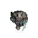
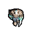

# Walkthrough: Setup de Proyecto, Pipeline Gráfico 3D-2D y Catálogo de Ruinas

**Hito:** `00-project-setup-pipeline` · **Estado:** Completado

## 1. Resumen Ejecutivo
Se ha establecido la infraestructura completa para el desarrollo de **DungeonDS** (ARPG procedural gótico/nigromancia en Nintendo DS), heredando el estándar de toolchain de `towerds` pero sin acoplamiento a código o mecánicas previas.

Además, se ha creado y validado el pipeline de conversión de modelos 3D esqueléticos a sprites 2D pre-renderizados en 8 direcciones, junto con la incorporación del catálogo modular gótico de 300 piezas *Dreadhollow*.

---

## 2. Evidencia Visual

| Render Base (In-place) | Con Filtros de Legibilidad NDS (Borde 1px + Contraste) |
| :---: | :---: |
|  |  |

---

## 3. Componentes Entregados

1. **Pipeline de Renderizado Headless (`tools/render_spritesheet.py`)**:
   - Soporte automático para modelos `.fbx`, `.glb` y `.obj`.
   - Cámara ortográfica a 60° (perspectiva dimétrica clásica).
   - Bloqueo de traslación de raíz (*root-motion*) para generar ciclos de andar estables en el sitio (*in-place*).
2. **Laboratorio de Ajuste Visual (`sprite_lab.html` / `tools/make_lab.py`)**:
   - Previsualización en tiempo real con escalado nearest-neighbor (1x, 2x, 4x, 8x).
   - Contorno de 1px parametrizable, ajuste de contraste, brillo, saturación y sombra inferior.
   - Exportador de GIFs animados escalados.
3. **Pack Modular de Ruinas (`assets/environment/dreadhollow/`)**:
   - 300 modelos `.glb` góticos (suelos de cripta, osarios, muros, arcos rotos, pilares) con texturas PBR integradas.
   - Catálogo interactivo offline en `Previews/catalog.html`.
4. **Toolchain Nintendo DS**:
   - Integración de la skill `ds-game-dev`, plantillas de compilación BlocksDS y scripts de automatización en `scripts/`.
