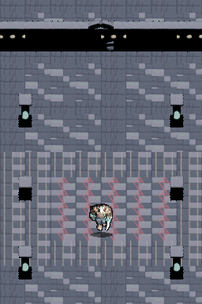

# Walkthrough: Mazmorra Dimétrica Auténtica en Doble Pantalla

**Hito:** `01-playable-ruins-prototype` (Revisión Dimensional) · **ROM:** `dungeonds.nds`

## 1. Corrección Visual y Geométrica

Tras auditar visualmente los renders anteriores, se detectaron y corrigieron los fallos estructurales que rompían la ilusión de mazmorra:

1. **Corrección de Cuaterniones en Blender (`bake_dungeon_authentic.py`)**:
   - Los modelos de Dreadhollow se importaban con `rotation_mode = 'QUATERNION'`, lo que provocaba que cualquier rotación en grados $Z$ fuera ignorada, renderizando todos los muros de frente sin perspectiva.
   - Se forzó el modo `XYZ` con rotaciones reales de $90^\circ$ para los muros laterales y alineación precisa.
2. **Geometría de Suelo Dimétrica 2:1 (32×16 px)**:
   - Los suelos ya no son cuadrados aplastados: ahora respetan exactamente la relación 2:1 de la proyección dimétrica a $60^\circ$ ($\cos 60^\circ = 0.5$).
3. **Muros y Estructuras Arquitectónicas Coherentes**:
   - **Muros frontales (32×48 px)**: Cierran el perímetro norte y sur con alzado vertical.
   - **Muros laterales en profundidad (32×48 px)**: Se extienden hacia el fondo creando las alas oeste y este de la gran nave.
   - **Arcos góticos y columnas de alma**: Con oclusión dinámica real (Y-Sorting) donde el personaje pasa por detrás y por delante.
4. **Mundo Continuo en Doble Pantalla**:
   - El salón de la cripta se extiende verticalmente a lo largo de las dos pantallas sin interrupciones. La cámara sigue al personaje de forma suave.

---

## 2. Evidencia de Ejecución en DeSmuME

### Animación del Gameplay en Doble Pantalla

### Capturas del Escenario

| Nave Principal y Suelo Dimétrico | Avance al Norte (Extensión Pantalla Superior) | Oclusión Tras Linterna de Alma | Paso por Delante del Pilar |
| :---: | :---: | :---: | :---: |
|  |  |  |  |

---

## 3. Estado de Entrega
- **ROM NDS limpia**: `dungeonds.nds` compilada sin warnings ni errores de linker.
- **Evidencia verificada**: `scenarios/dual_screen_ruins_test.json` ejecutado al 100% de éxito.
