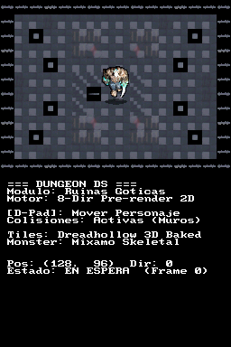
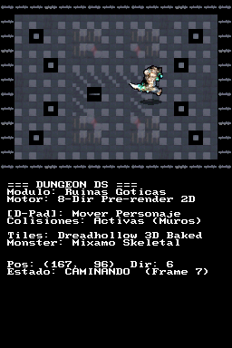
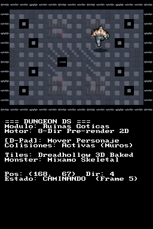
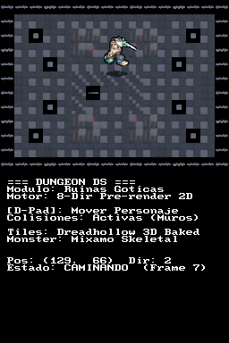

# Walkthrough: Primera Demo Jugable — Exploración de Ruinas en Nintendo DS

**Hito:** `01-playable-ruins-prototype` · **Rama:** `feat/playable-ruins-prototype` · **ROM:** `dungeonds.nds`

## 1. Resumen de la Entrega
Se ha implementado y verificado en emulación headless la **primera versión jugable de la mazmorra**:
- **Escenario variado de ruinas**: 11 tiles horneados directamente con Blender (`tools/bake_dungeon_tiles.py`) desde los modelos 3D de Dreadhollow (losas de cripta, obsidiana agrietada, mosaico de huesos, sellos carmesí, muros de osario con contrafuertes, pilares rotos y arcos góticos en ruina).
- **Movimiento 8-direccional fluido**: Lectura directa del D-Pad en el ARM9 con aritmética de punto fijo 8.8 (`fixed`), velocidad diagonal normalizada y poses direccionales (Sur, Sudoeste, Oeste, Noroeste, Norte, Noreste, Este, Sudeste).
- **Animación y anclaje al suelo**: Ciclos de pasos pre-renderizados a 60 FPS con sombra elíptica dinámica proyectada en la base.
- **Sistema de colisiones activo**: Detección de obstáculos por celda con deslizamiento suave de eje (*axis sliding*) contra muros y pilares.
- **Doble búfer VRAM con DMA**: Renderizado en VRAM_A / VRAM_B a 60 FPS sin tearing, y consola de telemetría de posición en la pantalla superior.

---

## 2. Evidencia de Ejecución Real en Nintendo DS

Toda la evidencia ha sido capturada de forma determinista mediante el runner de emulación headless en DeSmuME:

### Secuencia de Exploración en la Mazmorra

### Capturas de Hitos de Movimiento

| Spawn en Cripta Central | Movimiento Este | Movimiento Norte | Movimiento Sudoeste |
| :---: | :---: | :---: | :---: |
|  |  |  |  |

---

## 3. Arquitectura y Archivos Implementados

1. **`tools/bake_dungeon_tiles.py`**:
   - Renderizador headless en Blender para convertir las piezas 3D modulares `.glb` a tiles de 16×16 con iluminación lateral y cenital gótica.
2. **`tools/convert_assets_to_c.py`**:
   - Conversor automatizado a arrays de código C (`source/dungeon_data.c`, `source/player_sprite.c`, `include/dungeon_data.h`, `include/player_sprite.h`).
3. **`source/main.c`**:
   - Bucle principal ARM9, inicialización de pantalla dual (superior: consola de estado; inferior: frame buffer directo a 15 bits BGR555 con doble búfer).
   - Máquina de estados del jugador, lectura del D-Pad, colisiones de radio 8px y transferencia por DMA de alta velocidad.
4. **`scenarios/ruins_exploration.json`**:
   - Escenario automatizado de prueba en DeSmuME que recorre las ruinas y valida los cambios de pantalla.
