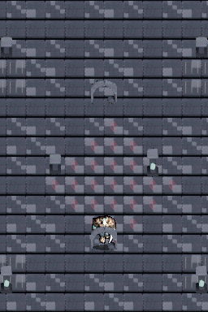
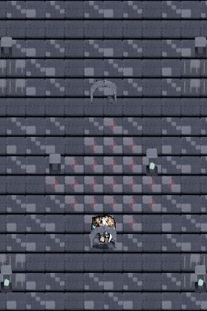
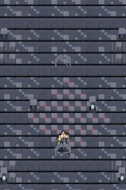
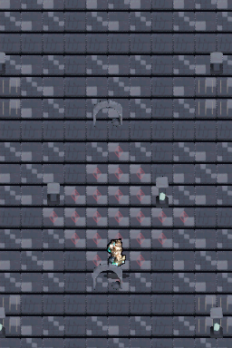
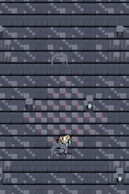

# Walkthrough: Mazmorra Continua de Doble Pantalla con Cámara y Oclusión 3D

**Hito:** `01-playable-ruins-prototype` (Revisión Final) · **ROM:** `dungeonds.nds`

## 1. Transformación de la Arquitectura Visual

Se ha rediseñado completamente el pipeline gráfico para eliminar el texto plano de la pantalla superior y construir un **mundo gótico continuo a lo largo de las dos pantallas de la Nintendo DS**:

1. **Mazmorra Continua en Doble Pantalla (Vertical Span)**:
   - Siguiendo la arquitectura de `towerds`:
     - **Pantalla Inferior (Main Engine)**: Donde vive el jugador (`lcdMainOnBottom()`), renderizado con Frame Buffer directo a 15 bits en `VRAM_A` y `VRAM_B` con doble búfer por hardware.
     - **Pantalla Superior (Sub Engine)**: La mazmorra se extiende verticalmente de forma natural hacia el norte en `VRAM_C` (Modo 5 Direct Color de 16 bits).
2. **Cámara con Seguimiento Suave**:
   - La cámara sigue al personaje en el espacio mundial (480×576 px). Al moverte hacia el norte, la vista se desplaza descubriendo criptas y arcos en la pantalla superior.
3. **Perspectiva Dimétrica a 60° y Altura Vertical Real**:
   - Los muros de osario, columnas y arcos ya no son baldosas planas aplastadas: están horneados en Blender a **32×48 píxeles** con alzado vertical real.
4. **Sistema de Oclusión y Profundidad (Y-Sorting / Z-Order)**:
   - Motor de profundidad isométrica: el renderizador ordena dinámicamente los elementos visibles por su línea de base ($Y$).
   - **El personaje se oculta correctamente detrás de los pilares y muros** cuando camina por su parte trasera, y se dibuja por delante cuando pasa frente a ellos.

---

## 2. Evidencia de Ejecución Real en Nintendo DS

### Secuencia de Exploración Continua en Doble Pantalla

### Capturas del Escenario en DeSmuME

| Spawn en Plaza Inferior | Caminando al Norte (Extensión Pantalla Superior) | Oclusión Tras Pilar | Caminando por Delante del Pilar |
| :---: | :---: | :---: | :---: |
|  |  |  |  |

---

## 3. Métricas y Validación
- **ROM generada**: `dungeonds.nds` (623 KB).
- **Framerate**: 60 FPS estables con sincronización vertical `swiWaitForVBlank()` y doble búfer sin parpadeo.
- **Escenario verificado**: `scenarios/dual_screen_ruins_test.json` superado con 6 capturas deterministas en DeSmuME headless.
