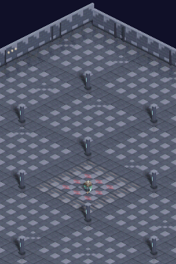
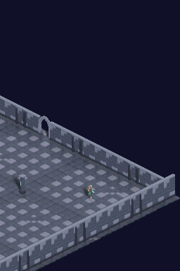
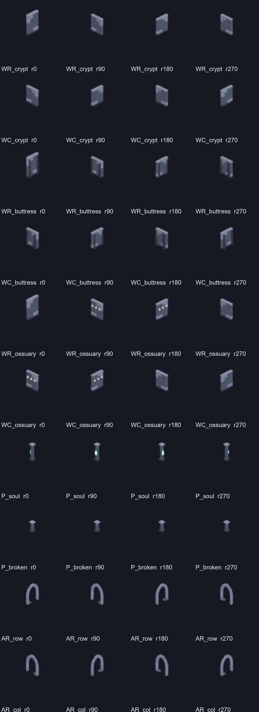
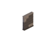
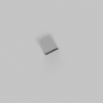
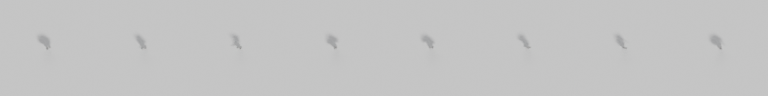

# Walkthrough: del bake 3D a la composición dimétrica en Nintendo DS

**Hito:** `02-isometric-renderer`

**Preset verificado para sombras:** `e30` (elevación 30°, suelo dimétrico 2:1)

**ROM de la evidencia:** CRC `3BF21FA2`

**Estado:** pipeline y sombras `e30` verificados en DeSmuME; `e60` y hardware
físico pendientes.

## En dos minutos

El juego no renderiza geometría 3D. Blender se usa fuera de línea para
convertir los modelos del escenario y el personaje en sprites, más máscaras de
sombra independientes. En Nintendo DS, el motor dibuja el suelo, compone esas
máscaras sobre los píxeles de suelo y pinta después los sprites. Así la silueta
y dirección de la sombra vienen de la escena 3D, pero el coste en juego es una
mezcla entera sobre pequeños búferes 2D.

La diferencia práctica es importante: una elipse escrita a mano en C no sabe
si la entidad es un personaje, una columna o un arco. La máscara horneada sí
contiene la respuesta de luz para el objeto, su orientación y la pose de
referencia elegida.

## Evidencia visual de la ROM actual

Estas capturas vienen de `scripts/run-scenario.ps1` ejecutado sobre la ROM
compilada. `00_spawn` muestra el escenario al inicio; `01_walking` muestra el
estado después de enviar la secuencia de movimiento. Las dos imágenes son la
pantalla real del juego en DeSmuME, no un mockup compuesto fuera del motor.

| Inicio del escenario | Captura durante/después de caminar |
| :---: | :---: |
|  |  |

La primera permite inspeccionar la distribución de suelo, muros y columnas; la
segunda muestra el arco en la pared y la escena con cámara desplazada. La
secuencia no incluye una aserción independiente de que el juego consumió la
entrada: un cambio de captura o su hash no demuestra por sí solo el
funcionamiento del controlador. El resultado es evidencia del emulador, no de
una consola DS física.

## 1. El problema original

El trabajo comenzó por fallos que parecían “sprites mal cortados”, pero la
causa no era única. Se mezclaban decisiones de cámara, pivote, orientación,
recorte y composición:

- La parte superior de algunos muros y arcos quedaba fuera del canvas, aunque
  en la composición global el recorte podía ser difícil de detectar.
- Los muros norte/sur y este/oeste se confundían. En una misma pared, usar la
  orientación contraria cambiaba qué extremo, canto e iluminación llegaban a
  la unión.
- Las columnas parecían flotar o desplazarse porque el centro visual del PNG
  se trataba como si fuera el punto de apoyo. El centro del rectángulo no es
  automáticamente el punto 3D que toca el suelo.
- El personaje y las columnas recibían manchas de sombra genéricas, separadas
  de sus pies y sin relación con la dirección de la luz.
- Los assets individuales podían parecer correctos y aun así formar una sala
  defectuosa: el criterio no era “el sprite se ve bien aislado”, sino que
  orientación, ancla, escala, solapes y sombra coincidieran en el mismo
  sistema de coordenadas.

La lección metodológica fue dejar de ajustar offsets particulares por
inspección. Primero fijamos el contrato de proyección y ancla; después hacemos
que cada etapa transporte esos datos explícitamente y comprobamos tanto el
asset aislado como su composición en el juego.

## 2. Contrato geométrico y anclas

### Suelo y cámara

En `e30`, un tile de suelo ocupa `32×16` píxeles: proporción dimétrica 2:1.
La proyección de una celda `(col,row)` desplaza horizontalmente las diagonales
en pasos de 16 px y verticalmente en pasos de 8 px. La misma configuración de
`tools/ds_look.py` alimenta al horneador del entorno y al del personaje. Si
cámara, escala de píxel o elevación difieren, el ancla proyectada deja de
coincidir aunque ambos PNG sean transparentes y estén “centrados”.

### Muros, arcos y objetos

Los objetos del entorno usan canvas `96×96`; el origen de suelo se proyecta a
`(48,48)`. Por tanto, el rectángulo se coloca con su centro en el punto del
mundo que representa el centro de la celda. El algoritmo no busca el píxel
opaco más bajo: esa búsqueda fallaría con arcos, objetos flotantes o
geometrías asimétricas. El pivote es un dato de la escena 3D, no una propiedad
que se pueda inferir de forma universal de la silueta 2D.

### Personaje

Cada celda animada del jugador mide `64×64`; el metadato
`assets/characters/monster/player_e30_anchor.json` fija el ancla proyectada en
`(32,32)`. El horneador conserva la posición raíz de la armature en el plano y,
para cada pose, evalúa la geometría deformada, encuentra su mínimo en Z y la
traslada hasta apoyar ese mínimo en el suelo. Es crucial hacerlo por pose: un
mínimo global del ciclo haría que algunas fases de la animación pareciesen
levitar.

La ficha JSON también conserva preset, posición 3D del ancla, azimut,
elevación, escala de píxel, método de apoyo y número de direcciones/frames.
Esto hace inspeccionable el origen de la alineación; evita depender de una
corrección manual escondida en el dibujado C.

## 3. Orientación: cuatro rotaciones, no dos

Cada familia de objeto se hornea en `r000`, `r090`, `r180` y `r270`. La
orientación que se asigna a una celda del mapa debe corresponder a la dirección
de la pared en el mundo. Las texturas, relieves, arbotantes, extremos e
iluminación rompen la simetría perfecta; por tanto, una imagen girada o
invertida no siempre equivale al bake de la orientación opuesta.

La siguiente lámina es una composición de los PNG reales generados para el
runtime, ampliados con nearest-neighbor 4×. Cada renglón es una familia y cada
columna una rotación. Se muestra el canvas completo, no un recorte automático:
el espacio transparente permite ver dónde cae el contenido respecto al
centro del sprite.



La lámina sirve para comprobar la orientación y detectar cambios de forma
entre bakes. No sustituye a la prueba de encaje: para revisar una unión hay que
ver segmentos consecutivos colocados en el mapa, con la misma escala y
proyección que tendrá el juego.

## 4. Cómo se producen y usan las sombras

### Del objeto 3D a una máscara

Cada objeto tiene dos resultados de bake: el sprite visible con transparencia y
un pase separado de Cycles Shadow Catcher. El segundo contiene la contribución
de la sombra en escala de grises sobre un fondo iluminado. Se generan 40
máscaras de entorno (10 familias por cuatro rotaciones). Para el personaje se
genera una máscara por cada una de sus ocho direcciones, muestreada desde una
pose plantada de referencia.

Ejemplo del par de archivos. El primer PNG es el muro que se pinta; el segundo
es su pase de sombra aislado. El gris claro es fondo sin sombra, la región
oscura es cobertura de sombra. No son dos versiones intercambiables del
objeto: el conversor los procesa de manera distinta.

| Sprite de muro | Pase Cycles Shadow Catcher del mismo bake |
| :---: | :---: |
|  |  |

Para el jugador, una sola imagen contiene las ocho celdas de sombra, una por
orientación. Son de pose fija para evitar recalcular y hacer fluctuar la
sombra con cada frame del paso:



### Conversión del pase a cobertura

No usamos el alfa del PNG como cobertura. En Blender 5.2 el archivo de salida
observado era RGB y el alfa era constante, así que ese canal no describía la
sombra. `tools/shadow_masks.py` aplica este procedimiento:

1. Convierte los canales RGB a luminancia.
2. Estima el valor “iluminado” con la mediana de las bandas de 8×8 píxeles en
   las cuatro esquinas.
3. Estima el extremo oscuro con el percentil 0,5 de la luminancia de la
   imagen; la diferencia entre ambos determina el contraste útil.
4. Convierte la pérdida de luz a cobertura de 0–255. Diferencias de 2 niveles
   o menos se tratan como fondo. Si el contraste total es menor que 8, falla
   explícitamente en vez de guardar una máscara aparentemente válida pero
   vacía.

Es una interpretación del pase renderizado, no una máscara RGBA proporcionada
por Blender. Si cambia el formato, el color management o el fondo del render,
hay que revalidar esas hipótesis con los extremos y contraste de los píxeles.

### Formato compacto para ARM9

El pase de objeto se renderiza a `128×128` a la escala de píxel del juego para
que la penumbra de arcos y objetos anchos no se corte en el límite de un canvas
de `96×96`. El conversor extrae el centro `96×96`, cuantiza cada cobertura a
4 bits y guarda dos píxeles en cada byte. También calcula la caja
`[x,y,w,h]` de cobertura significativa (`>8`), que limita el bucle de
composición a la zona ocupada. El personaje ya hornea celdas de sombra de
`96×96`, también empaquetadas a 4 bits.

La reducción de tamaño no cambia el origen del objeto: el recorte es central,
así que la máscara conserva el mismo centro de suelo del sprite visible. Si se
cambia el canvas o el encuadre, deben cambiar a la vez horneador, conversor,
test y dimensiones C.

### Composición por frame

`source/main.c` hace lo siguiente:

1. Copia la ventana visible desde la caché de suelo.
2. Recorre las entidades y coloca cada máscara usando la posición del ancla y
   el offset de cámara.
3. Desempaqueta el nibble correspondiente: `0..15`, convertido a cobertura
   efectiva multiplicando por 17.
4. Oscurece proporcionalmente sólo si el píxel de destino pertenece al suelo
   y no es `VOID_COLOR`. La fuerza máxima del factor actual es ~44%.
5. Pinta encima los sprites con su alpha 1-bit, respetando el orden de
   profundidad; así un objeto oculta la parte de sombra que no debe verse.

En ARM9 este proceso usa enteros y formatos BGR555. No se renderiza ni se
consulta la escena 3D durante el juego. El suelo recibe sombras, pero no tiene
una máscara emisora propia.

## 5. Qué probamos y por qué falló

| Intento | Síntoma/causa | Decisión actual |
| :--- | :--- | :--- |
| Elipse programática idéntica para todas las entidades | Forma, desplazamiento y tamaño no seguían la silueta, la orientación ni los pies reales; parecía una mancha dibujada encima. | Eliminada. La forma y cobertura provienen del pase 3D. |
| Leer el alfa del PNG | El alfa era constante aunque el RGB sí contenía la sombra. | Leer luminancia RGB y estimar fondo y contraste. El alfa se registra sólo como diagnóstico. |
| Usar sólo `Combined` o la API de composición antigua | El pase Shadow Catcher no llegaba a la salida en Blender 5.2. | Activar `view_layer.cycles.use_pass_shadow_catcher`, tomar el socket `Shadow Catcher` y conectarlo a `scene.compositing_node_group`. |
| Marcar el catcher con `catcher.cycles.is_shadow_catcher` | Propiedad ausente en la versión usada. | Usar `Object.is_shadow_catcher`. No copiar código de una API anterior sin comprobarla contra la versión real. |
| Renderizar máscara al mismo tamaño estrecho del sprite visible | Las sombras de objetos anchos, especialmente arcos, tocaban y se cortaban por el borde. | Mantener la escala, ampliar el pase a `128×128`, recortar luego la ventana central `96×96`. |
| Empaquetar máscaras `128×128` con un byte por píxel | La primera compilación excedió el presupuesto de EWRAM. | Reducir al canvas usado por runtime, cuantizar a 4 bits y recorrer sólo la caja de cobertura. La compilación posterior pasó. |
| Capturar DeSmuME inmediatamente al arrancar | El primer PNG se tomaba antes del primer frame completo del doble búfer y aparecía negro. | Esperar 60 frames antes de la captura inicial del escenario. |
| Centrar visualmente objetos mediante su bbox opaco | Bbox no representa un punto de suelo común; falla con arcos, formas asimétricas y personaje animado. | Transportar un ancla 3D definida; en el jugador, medir mínimo Z por pose antes de proyectar. |
| Deducir todas las paredes a partir de dos imágenes | Los extremos, asimetrías y relieves no se conservaban de modo coherente al invertir. | Hornear y asignar explícitamente las cuatro rotaciones. |

Una causa se considera confirmada cuando el síntoma se puede reproducir y la
corrección elimina ese fallo en el test/build pertinente. No todas las
decisiones artísticas quedan demostradas por una compilación: la composición
visual todavía necesita revisión humana en las capturas.

## 6. Invariantes que deben sobrevivir a nuevos assets

La fuente canónica para arquitectura de render y formato es
[`TECHNICAL.md`](../../TECHNICAL.md). Para incorporar una pieza nueva:

1. Definir el punto de apoyo y la orientación en coordenadas 3D antes de
   hornear; no adivinar el ancla a partir del PNG.
2. Usar el mismo `ds_look` (azimut/elevación, escala de píxel, cámara y luces)
   para suelo, entorno y personaje.
3. Emitir cuatro rotaciones de pared/arco/columna y registrar qué rotación
   consume cada dirección del mapa. Revisar una unión real a close-up.
4. Hornear el Shadow Catcher independiente, verificar fondo, contraste,
   dimensiones y que la sombra no alcance el borde de forma truncada.
5. Mantener juntos el PNG, su sombra, su identificador en C y el límite de
   cobertura. Un sprite y una máscara con índices desfasados son una pareja
   incorrecta aunque cada uno pase su validación aislada.
6. Mantener el formato runtime: objetos `96×96` centrales del pase `128×128`,
   sombras `4 bpp` y caja `[x,y,w,h]`; jugador `96×96` por dirección. Recalcular
   presupuesto y medir build si cambia el tamaño/número de máscaras.
7. Mantener orden de dibujo suelo → sombras → sprites, omitir vacío y conservar
   el cálculo de movimiento/cámara en enteros de ARM9.
8. Probar tanto contrato de máscara como escena compuesta. Un PNG aislado no
   detecta orientación equivocada, empalme abierto, solape incorrecto ni
   sombra que cae fuera del suelo.

La habilidad del flujo actual es automatizar conversiones y convenciones; no
puede decidir por sí sola si una junta se ve convincente o si el peso visual
de una sombra es agradable. Esos dos puntos siguen requiriendo inspección y
criterio humano.

## 7. Reproducción y validación

### Requisitos

- Python con Pillow y la instalación local de Blender 5.2.
- Modelos de entrada de Dreadhollow y `Walking.fbx` en sus rutas locales
  configuradas en los scripts. El pack de modelos pesados está excluido del
  repositorio; un clon limpio no puede rehacer el bake sin esos datos.
- Docker/BlocksDS y el runner DeSmuME/WSL2 descritos en la skill y disponibles
  en este workspace.

### Comandos

```powershell
# Regenerar desde las escenas 3D (requiere los modelos locales)
python tools\bake_dungeon_iso.py --preset e30
python tools\bake_player.py --preset e30

# Convertir sprites/máscaras a datos BGR555 y cobertura para C
python tools\convert_iso_to_c.py --preset e30

# Contratos de máscara, compilación y escenario real
python tests\test_shadow_masks.py -v
pwsh -File scripts\build-project.ps1 -ProjectPath .
pwsh -File scripts\run-scenario.ps1 `
  -RomPath .\dungeonds.nds `
  -ScenarioPath .\scenarios\integration_showcase_walk.json `
  -OutputPath .\artifacts\baked_shadows_final
```

### Resultado registrado

- `test_shadow_masks.py`: 2 tests pasan. Se inspeccionan 40 pases de objeto
  (`10×4`) y ocho máscaras del jugador; se comprueban tamaño, rango no vacío y
  contraste/fondo.
- BlocksDS: build `PASS`, sin warnings en la salida, ROM `dungeonds.nds`.
- DeSmuME: `DSM_SCENARIO_RESULT=PASS`, tres capturas y cinco eventos; CRC
  `3BF21FA2`. La copia de evidencia incorporada a este walkthrough está en
  `assets/runtime_e30_evidence/`, junto con `manifest.json`, `events.jsonl` y
  `emulator.log` de esa ejecución.
- Capturas revisadas: muestran el cuarto de inicio y la sala con arco; no
  constituyen una aserción automática de que las sombras sean perceptualmente
  perfectas ni de que se haya consumido el botón del escenario.

## 8. Límites actuales y siguiente trabajo

- Se verificó `e30`. Hay renders previos de comparación `e60`, pero el pase de
  sombras `e60` no se ha rehecho y la prueba de máscaras no cubre ese preset.
- El jugador reutiliza una sombra de pose plantada por dirección; no hay una
  máscara distinta por cada uno de los ocho frames de caminar. Se eligió así
  para controlar memoria y evitar parpadeo, pero cambios grandes de pose podrían
  justificar más muestras.
- La prueba de máscaras verifica archivos e invariantes básicos, no juzga
  visualmente cada solape de pared, unión de tiles o penumbra sobre cada tipo
  de suelo. Para eso hace falta escenario/captura y revisión.
- La evidencia es de DeSmuME. No certifica velocidad, memoria libre en hardware,
  pantalla física, audio ni compatibilidad DS/DSi real.
- El escenario envía movimiento y captura estados, pero falta un preflight que
  haga una aserción inequívoca del consumo de esa entrada por el juego. Hasta
  añadirlo, las capturas sirven para revisar composición; no son prueba
  concluyente del control.

El siguiente paso técnico de esta ruta es completar bake, tests, compilación y
revisión visual de `e60`, y añadir una aserción input-contract del movimiento
antes de usar el escenario como validación de control.
