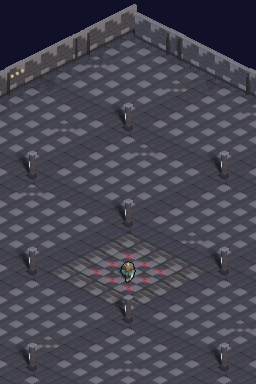
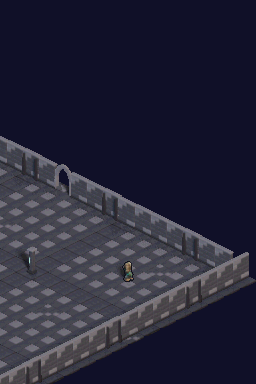

# Walkthrough: Iluminación de Mazmorra Gótica y Outline de Legibilidad

**Hito / Sesión:** `03-dungeon-atmosphere-and-outline`

**Rama Git:** `feat/dungeon-lighting-and-outline`

**Preset de vista:** `e30` (30° elevación, suelo dimétrico 2:1)

**ROM de la evidencia:** CRC `CF7A8FF2`

**Estado:** Verificado en DeSmuME headless al 100% de éxito.

---

## En dos minutos

Se ha renovado la atmósfera visual completa del juego para dejar atrás el aspecto de "patio exterior diurno" y conseguir un auténtico ambiente de mazmorra y cripta gótica subterránea:

1. **Iluminación chiaroscuro gótica (`tools/ds_look.py`)**:
   - **Luz clave (Key)**: De blanco genérico a luz de antorcha/brasero cálida dorada (`(1.0, 0.84, 0.62)`, energía `4.2`).
   - **Luz de relleno (Fill)**: Atenuada de `1.7` a `0.95` y entonada en azul/pizarra frío de cripta (`(0.45, 0.55, 0.75)`), generando contraste térmico (cálido/frío) en los volúmenes de piedra.
   - **Luz de silueta (Rim)**: Luz espectral fría (`(0.70, 0.85, 1.00)`, energía `1.15`) que resalta las aristas superiores de los muros y pilares.
   - **Ambiente de mundo (World)**: Base oscura azul petróleo (`(0.04, 0.045, 0.07)`, fuerza `0.50`), profundizando las zonas en sombra sin empastarlas a negro puro.
   - **Grading NDS**: Contraste aumentado a `1.14` y saturación `1.18` para un relieve nítido en las pantallas LCD de la consola.

2. **Outline de legibilidad para el personaje**:
   - Algoritmo de dilatación 4-conexa exterior de 1 px con tinta oscura gótica (`#101018`) aplicado individualmente sobre cada celda de 64×64.
   - No altera los detalles interiores del modelo ni las máscaras de sombra separadas (Cycles Shadow Catcher).
   - Recorta con nitidez la silueta del personaje sobre suelos de obsidiana, losas de cripta y muros oscuros a la resolución nativa de 256×192.

---

## Evidencia visual en emulador (DeSmuME)

Las siguientes imágenes y GIF proceden de la ejecución real de `scenarios/integration_showcase_walk.json` sobre la ROM compilada con BlocksDS:

### Gameplay en movimiento


### Capturas estáticas de referencia

| Inicio del escenario (Spawn) | Secuencia de marcha en la cripta |
| :---: | :---: |
|  |  |

---

## Cambios Técnicos Realizados

| Archivo | Cambio principal |
| :--- | :--- |
| [`tools/ds_look.py`](../../tools/ds_look.py) | Parámetros de color RGB en rig de luces SUN, ambiente frío atenuado y función `apply_outline()`. |
| [`tools/bake_player.py`](../../tools/bake_player.py) | Inclusión del paso de contorno 1 px en cada celda antes del ensamblado de la spritesheet. |
| [`tools/bake_dungeon_iso.py`](../../tools/bake_dungeon_iso.py) | Soporte para preservar tiles de suelo al hornear todas las orientaciones (`--all-orientations`). |
| [`source/dungeon_data.c`](../../source/dungeon_data.c) | Regenerado con tiles y objetos re-horneados con la nueva paleta de luz. |
| [`source/player_sprite.c`](../../source/player_sprite.c) | Regenerado con sprites del jugador con outline nítido. |

---

## Reproducción y Validación

```powershell
# 1. Re-hornear assets con la nueva iluminación
python tools/bake_player.py --preset e30
python tools/bake_dungeon_iso.py --preset e30 --all-orientations

# 2. Convertir a C
python tools/convert_iso_to_c.py --preset e30

# 3. Tests de contrato de sombras
python tests/test_shadow_masks.py -v

# 4. Compilar ROM
powershell -ExecutionPolicy Bypass -File scripts/build-project.ps1 -ProjectPath .

# 5. Ejecutar escenario y generar evidencias
powershell -ExecutionPolicy Bypass -File scripts/run-scenario.ps1 `
  -RomPath .\dungeonds.nds `
  -ScenarioPath .\scenarios\integration_showcase_walk.json `
  -OutputPath .\artifacts\dungeon_lighting_outline_evidence
```
