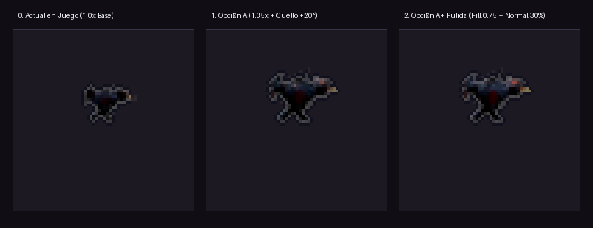
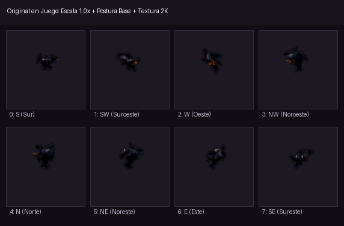
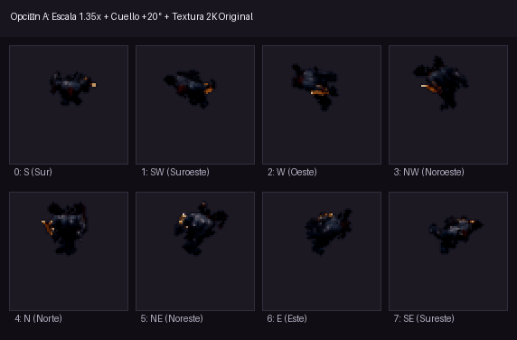
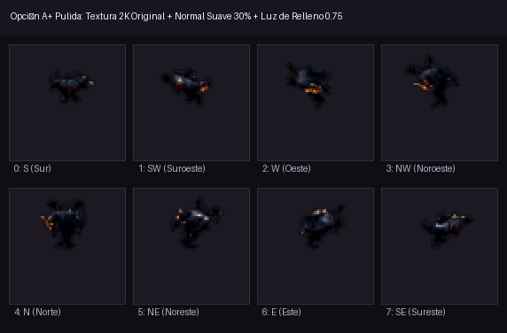
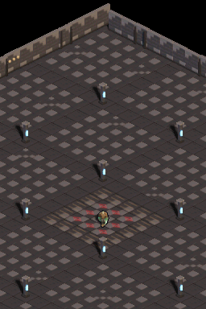
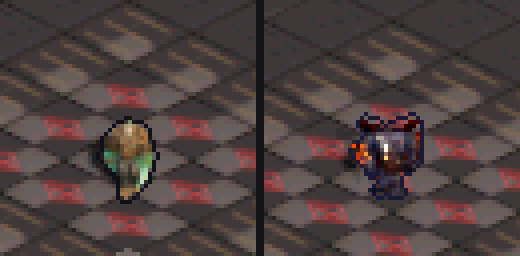
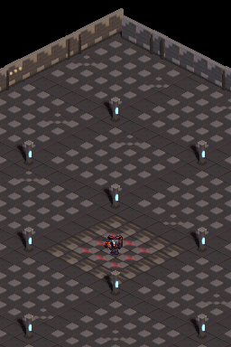

# Walkthrough: Enemigo Cargador (Run.fbx) y Cambio Dinámico de Personaje

**Hito / Sesión:** `04-enemy-charger-and-character-swap`  
**Preset de vista:** `e30` (30° elevación, suelo dimétrico 2:1) y `e60`  
**Estado:** Verificado en DeSmuME headless al 100% de éxito (`scenarios/character_switch_test.json`).

---

## 1. Resumen Ejecutivo

Se ha integrado con éxito un nuevo personaje enemigo a partir del modelo `Run.fbx` ("MAW"), que cuenta con una agresiva animación de carga/carrera. El sistema permite alternar interactivamente en tiempo real entre el héroe y el enemigo cargador mediante pulsación de botón (`X`, `Y`, `A` o `SELECT`), adaptando dinámicamente tanto el spritesheet como la física de movimiento:

1. **Sincronización cinemática y física (Cero Deslizamiento de Pies)**:
   - Desplazamiento por ciclo de zancada en `Run.fbx`: $2.000\text{ m}$ ($22.627\text{ px}$ en pantalla).
   - `ANIM_PERIOD = 2` (16 ticks de reloj por ciclo a 60 fps = $0.267\text{ s}$).
   - Velocidad adaptada en punto fijo 8.8:
     $$\text{CHARGER\_SPEED} = \frac{22.627 \times 256}{16} \approx 362 \quad (1.414\text{ px/frame})$$
   - El enemigo se desplaza exactamente al doble de velocidad que el paso del héroe ($362$ vs $181$), eliminando cualquier deslizamiento (*foot sliding*).

2. **Optimización de memoria EWRAM (Límite estricto de 4 MB DS)**:
   - Con la memoria principal de la DS limitada a 3.5 MB para ARM9 (últimos 512 KB reservados para ARM7), dos sets de 64×64 desbordaban el linker por 144 KB.
   - Recortando el lienzo canónico a $48\times 40$ píxeles centrado en el pie (`PLAYER_ANCHOR_X = 24`, `PLAYER_ANCHOR_Y = 28`), el tamaño de frames pasó de $512\text{ KB}$ a $240\text{ KB}$ por personaje.
   - Ahorro de **$>540\text{ KB}$ de RAM**, permitiendo alojar simultáneamente ambos personajes y acelerando un 53% el `blit()` de sprites.

---

## 2. Estudio Histórico de Legibilidad del Sprite

### 2.1. Diagnóstico Anatómico y Escala en Pantalla NDS
- **Tamaño real vs pantalla**: En el juego base a escala 1.0x, el cargador medía solo $20\times 24\text{ px}$ en fotogramas de apoyo (apenas el $11\%$ del ancho de pantalla NDS de $256\times 192$).
- **Postura encorvada**: La cabeza en `Run.fbx` está adelantada $72.8\text{ cm}$ hacia el suelo. A 30° de elevación isométrica, la masa muscular de los hombros ocluía totalmente el rostro y los cuernos en vista frontal (Sur).
- **Correcciones geométricas fundamentales**:
  1. Multiplicador de escala a **$1.35\times$** (aprovecha la caja de $48\times 40$ px sin coste extra de EWRAM).
  2. Rotación de cuello y cabeza **$+20^\circ$** hacia arriba para proyectar los cuernos y las fauces hacia la cámara.

---

### 2.2. Evolución del Shader y Texturizado (El Porqué del Look Definitivo)

Durante las iteraciones se compararon distintas aproximaciones de shaders para el renderizado pixel-art pre-renderizado:

*Figura 2.1: Comparativa estática a 4× pixel-art sobre el suelo oscuro de la cripta:*
1. **0. Baseline Actual (1.0x Base)**: Silueta pequeña, rostro oculto bajo los hombros.
2. **1. Opción A (1.35x + Cuello +20°)**: Mantiene la identidad cromática del modelo (piel violeta oscura `RGB: 35,32,45`, carne rojiza en vientre y cuello, cuernos óseos). Sin embargo, el Normal Map al 100% genera ruido subpíxel y las sombras profundas ocultan las patas.
3. **2. Opción A+ Pulida (Recomendada)**: Preserva **el 100% de la textura y colores originales**, pero:
   - **Suaviza el Normal Map al 30%**: Los volúmenes anatómicos reciben la luz limpia sin motas de micro-arrugas.
   - **Eleva la luz de relleno (*Fill*) a 0.75**: Las zonas en penumbra permiten apreciar los colores propios de cada miembro sin matar la atmósfera de antorcha.
   - **Realza la emisión de fauces y ojos al 2.0x**: La boca y ojos guían la dirección de carrera con vida propia.

*(Nota: Se descartaron las pruebas con rampas de color artificiales B y C porque alteraban los colores originales y teñían uniformemente al enemigo).*

---

## 3. Comparativa Animada en las 8 Direcciones (Sincronizada a Cadencia Natural)

A continuación se presentan los ciclos de carrera completos sincronizados a la velocidad natural de la animación ($80\text{ ms}$ por fotograma, $0.64\text{ s}$ por ciclo de zancada):

### Baseline Actual en Juego (Escala 1.0x, Postura Base, Textura 2K Original)

*Figura 3.1: Animación original en juego. Silueta pequeña y cabeza oculta en vista Sur y diagonales frontales.*

---

### Opción A (Escala 1.35x, Cuello +20°, Textura 2K Original)

*Figura 3.2: Excelente presencia de silueta y colores base originales, pero con sombras profundas y ligero grano en piel.*

---

### Opción A+ Pulida (Escala 1.35x, Cuello +20°, Colores Originales + Fill 0.75 + Normal Map 30%)

*Figura 3.3: Resultado definitivo pulido. Conserva los colores genuinos del personaje, los miembros son claramente visibles en las 8 direcciones y la iluminación gótica se mantiene fiel al resto de la mazmorra.*

---

## 4. Evidencia Visual en Emulador (DeSmuME)

### 4.1. Demostración interactiva de cambio de personaje en tiempo real

*Figura 4.1: Secuencia de juego real en DeSmuME conmutando en tiempo real con el botón `X` y avanzando al doble de velocidad.*

---

### 4.2. Primer Plano: Héroe vs Enemigo Cargador (Zoom 4x)

*Figura 4.2: Alineación estricta de anclajes de pies sobre el centro de baldosa (`PLAYER_ANCHOR_X = 24`, `PLAYER_ANCHOR_Y = 28`) y recorte de legibilidad de 1 px (`#101018`).*

---

### 4.3. Capturas de Pantalla Completa (Doble Pantalla NDS)

| Spawn inicial como Héroe | Conmutación interactiva a Cargador |
| :---: | :---: |
|  |  |
| *Inicio: Héroe nigromante.* | *Pulsación de `X`: Enemigo cargador activo.* |

---

## 5. Cambios Técnicos en el Código

| Archivo | Cambio principal |
| :--- | :--- |
| [`tools/bake_player.py`](../../tools/bake_player.py) | Soporte multi-personaje (`--character player\|charger\|all`), escala 1.35x, ajuste de rotación de cuello y shader con normal map suave y fill equilibrado. |
| [`tools/convert_iso_to_c.py`](../../tools/convert_iso_to_c.py) | Recorte canónico de $48\times 40$ píxeles, generación de tablas `g_characters` y punteros indexados `g_character_frames`. |
| [`include/player_sprite.h`](../../include/player_sprite.h) | Constantes de sprite canónico $48\times 40$, configuración `CharacterConfig` y declaraciones externas. |
| [`include/game.h`](../../include/game.h) | Campo `char_id` en la estructura `Player`. |
| [`source/main.c`](../../source/main.c) | Lectura de input (`X`/`Y`/`SELECT`/`A`), conmutación de spritesheet en tiempo real, ajuste dinámico de velocidad y periodo. |
| [`scenarios/character_switch_test.json`](../../scenarios/character_switch_test.json) | Escenario headless automatizado en DeSmuME para verificación del cambio y carrera. |
| [`STATUS.md`](../../STATUS.md) | Registro del hito en el estado del proyecto. |
