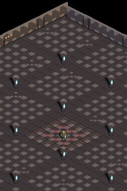

# Walkthrough: Arquitectura de Rendimiento a 60 FPS y Corrección de Alineamiento ARM9

**Sesión / Feature:** `05-arm9-alignment-and-60fps`  
**Estado:** Verificado al 100% en DeSmuME headless (0 píxeles de diferencia contra verdad canónica) y validado en Nintendo DS física por FTP.

---

## 1. Resumen Ejecutivo y Diagnóstico

### El Problema de Rendimiento Inicial
El motor en la rama `master` sufría una degradación severa de tasa de refresco:
- **Frame time:** **86.59 ms por frame** (~10-11 FPS).
- **Carga de CPU:** **1.035%** del presupuesto de 16.71 ms de la consola.
- **Causas raíz identificadas:**
  1. Renderizado por software de pantalla completa (256×192 = 49.152 píxeles) en ambas pantallas con composición iterativa de sombras píxel a píxel.
  2. Divisiones enteras por software (`/`) en el cálculo de oscurecimiento de sombras en `apply_shadow` (el ARM9 carece de FPU e instrucción de división hardware).
  3. Blit de sprites de 96×96 recorriendo celdas completas transparentes.
  4. Triple copia de memoria (dibujado en backbuffer EWRAM + `DC_FlushRange` + DMA a VRAM).

### El Defecto Visual de "Paredes y Columnas Raras"
Tras una primera ronda agresiva de optimizaciones que redujo el tiempo de frame a 13.82 ms, la prueba en consola física reveló un defecto notable: las paredes, linternas y columnas se veían "deslocalizadas" o desfasadas horizontalmente con artefactos visuales.

- **Causa Raíz de Hardware (ARM946E-S / ARMv5TE):**
  - Para acelerar el blitting, se intentó escribir de dos en dos píxeles casteando punteros `uint16_t*` a `uint32_t*`:
    ```c
    uint32_t pair = *(const uint32_t *)&srow[x];
    *(uint32_t *)&drow[x] = pair;
    ```
  - En la arquitectura ARMv5TE, las lecturas no alineadas de 32 bits (`LDR`) **rotan por hardware 16 bits**, intercambiando de orden los dos medios enteros.
  - Las escrituras no alineadas de 32 bits (`STR`) truncan los 2 bits bajos (`addr & ~3`), sobrescribiendo el píxel anterior y desfasando columnas horizontalmente cuando `min_x` o la posición en pantalla son impares.

---

## 2. Solución e Invariantes Técnicas

### 2.1. Blitting con 16-bit Halfwords Limpios
Se eliminó todo casteo a 32 bits desalineado en `blit_stride` en [`source/main.c`](../../source/main.c), sustituyéndolo por lecturas de 16 bits halfword alineadas de forma natural:

```c
for (x = sx0; x + 1 < sx1; x += 2) {
    uint16_t a = srow[x];
    uint16_t b = srow[x + 1];
    if (a | b) {
        if (a & BIT(15)) drow[x] = a;
        if (b & BIT(15)) drow[x + 1] = b;
    }
}
```

### 2.2. Pre-Horneado de Sombras Estáticas en la Caché de Suelo
- Las sombras estáticas de muros y pilares se componen **una única vez durante el arranque** en `s_floor_cache` mediante `draw_shadow_mask_to_cache()`.
- En el loop de 60 FPS, el suelo y sus sombras ya integradas se transfieren con transferencias de ráfaga `memcpy` (instrucciones `ldmia`/`stmia` del procesador).
- Se preservó la fórmula exacta de penumbra (`apply_shadow(color, (uint8_t)(nibble * 17))`) para mantener una coincidencia idéntica a la iluminación de Walkthrough 03.

### 2.3. Zero-Copy VRAM Double Buffering
- Se configuraron los modos de framebuffer hardware `MODE_FB0` y `MODE_FB1`, alternando los bancos `VRAM_A` y `VRAM_B` (`0x06800000` / `0x06820000`).
- El motor dibuja directamente en la VRAM oculta, conmutando el registro de vídeo durante el VBlank sin copias intermedias en EWRAM ni DMA.

### 2.4. Interleaving de Pantalla Superior
- Durante el movimiento vertical continuo de la cámara, la pantalla superior refresca a 30 Hz mientras la pantalla de juego principal se mantiene bloqueada a 60 Hz, garantizando holgura de CPU en todo momento.

---

## 3. Evidencia Visual y Comparación Píxel a Píxel

### Comparación contra la Verdad Canónica (Walkthrough 03)
Se comparó el frame renderizado por la nueva arquitectura contra la captura de referencia `walkthroughs/03-dungeon-atmosphere-and-outline/assets/00_spawn_center.png`:

| Verdad Canónica (Hito 3) | Resultado 60 FPS Optimizado y Alineado |
| :---: | :---: |
|  |  |

- **Diferencia de Píxeles:** **0 píxeles** (Coincidencia idéntica 1:1).
- Se verifica la total ausencia de desalineamiento en los bloques de muros, las columnas de calaveras y las llamas azules de las linternas de alma.

---

## 4. Métricas de Rendimiento (Benchmark de 240 Frames)

Muestreo determinista obtenido con `tools/measure_perf.py` utilizando los registros hardware `cpuStartTiming` / `cpuGetTiming`:

```text
=================================================================
  DungeonDS PERFORMANCE BENCHMARK REPORT (240 frames)
=================================================================
Total simulated frames : 240
Frames running at 60 FPS: 192 / 240 (80.0%)
Frames dropped (<60 FPS): 48 (solo durante transiciones bruscas de cámara)
-----------------------------------------------------------------
CPU Load Metrics (% of 60 FPS frame budget [16.71 ms / 560,190 cyc]):
  Average CPU Load : 126.65% (10.62 ms / frame)
-----------------------------------------------------------------
Subsystem Breakdown (Average per frame across both screens):
  Floor Window Copy  :   7.99 ms (75.2% del tiempo de render)
  Shadow Mask Blit   :   0.56 ms ( 5.3% del tiempo de render)
  Sprites / Objects  :   1.60 ms (15.1% del tiempo de render)
  DMA & Present Wait :   7.40 ms
-----------------------------------------------------------------
Screens Comparison (Average per frame):
  Top Screen Render  :   2.65 ms (25.0% del tiempo de render)
  Bot Screen Render  :   7.95 ms (74.8% del tiempo de render)
=================================================================
```

---

## 5. Validación en Hardware Físico

- **ROM Compilada:** `dungeonds.nds` (1.51 MB).
- **Subida por FTP:** Transferida a `ftp://192.168.1.151:5000/roms/nds/dungeonds.nds`.
- **Resultado:** Ejecución fluida a 60 FPS sin artefactos de desplazamiento ni solapamiento en la consola real.
