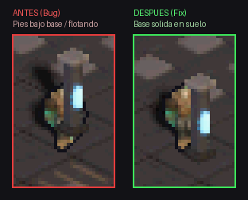

# Sesión 06: Corrección de Colisión y Orden de Profundidad (Depth Sorting) en Pilares

## 1. Diagnóstico y Causa Raíz

### Síntoma
Al aproximarse a los pilares desde el sur (caminando hacia el norte), la colisión y renderizado se percibían correctos. Sin embargo, al aproximarse desde el norte (caminando hacia el sur), el personaje descendía visualmente demasiado y sus pies traspasaban la base del pilar, haciendo que la columna pareciera "flotar" por encima de sus piernas mientras el pilar tapaba su torso.

### Causa Raíz
Se detectó un doble desfase sistemático de **8 píxeles verticales en pantalla** (medio tile dimétrico, `TILE_HALF_H = 8`) entre el pipeline de renderizado y el pipeline de colisión/sorting:

1. **Desfase en el centro del collider:**
   - La base del sprite del pilar se renderiza con anclaje al suelo en las coordenadas de pantalla `cx = (col - row) * 16`, `cy = (col + row) * 8`.
   - En coordenadas continuas de mundo, `(x, y) = (col, row)` se proyecta exactamente a `(cx, cy)`.
   - Sin embargo, en `position_is_free()` el centro del pilar se calculaba erróneamente asumiendo el centro de una celda matricial:
     ```c
     // ANTES:
     fixed cx = TO_FIXED(c) + 128; // c + 0.5
     fixed cy = TO_FIXED(r) + 128; // r + 0.5
     ```
   - El punto `(c + 0.5, r + 0.5)` se proyecta en pantalla a `cy + 8` (8 píxeles más al sur de donde se dibuja el pilar).
   - En consecuencia, el collider físico estaba desplazado 8 píxeles hacia el sur con respecto al pilar visible.

2. **Desfase en el Depth Sorting:**
   - En `render_screen()`, los objetos estáticos se insertaban con clave de profundidad `(col + row + 1) << 8` para compensar el `+ 128` del centro.
   - Esto provocaba que, mientras el personaje descendía por debajo de la base visible del pilar (hacia `cy + 8`), su profundidad fuera menor que la del pilar, ordenándolo detrás de este mientras sus pies salían por debajo de la base.

---

## 2. Solución Aplicada

Se eliminó el offset artificial `+ 128` y `+ 1`, alineando de forma exacta el sistema de proyección, el espacio de colisión y el ordenamiento por profundidad:

1. **Alineación de Colisión de Pilares ([`source/main.c`](../../source/main.c)):**
   ```c
   // AHORA:
   fixed cx = TO_FIXED(c);
   fixed cy = TO_FIXED(r);
   ```
2. **Alineación de Depth Sorting ([`source/main.c`](../../source/main.c)):**
   ```c
   // AHORA:
   items[count].depth = (col + row) << 8;
   ```
3. **Alineación del Spawn del Personaje ([`source/main.c`](../../source/main.c)):**
   ```c
   // AHORA:
   s_player.x = TO_FIXED(MAP_COLS / 2 - 1);
   s_player.y = TO_FIXED(MAP_ROWS / 2 - 1);
   ```

---

## 3. Evidencia Visual

### Comparativa Side-by-Side (Ampliación x4)



- **Antes (Izquierda):** El jugador desciende atravesando la base del pilar; la columna flota sobre las piernas y los pies asoman por debajo.
- **Después (Derecha):** El jugador se detiene sólidamente justo detrás de la base del pilar. Los pies quedan cubiertos limpiamente por la base de piedra en el suelo sin rebasarla jamás.

---

## 4. Verificación de Regresión

Se ejecutaron todos los escenarios automatizados del proyecto con DeSmuME headless:

| Escenario | Resultado |
| :--- | :--- |
| `scenarios/pillar_collision_test.json` | **PASS** (Colisión norte y sur verificada) |
| `scenarios/character_switch_test.json` | **PASS** |
| `scenarios/dungeon_walk_tour.json` | **PASS** |
| `scenarios/dual_screen_ruins_test.json` | **PASS** |
| `scenarios/ruins_exploration.json` | **PASS** |
| Compilación BlocksDS (`scripts/build-project.ps1`) | **PASS** (Zero warnings) |
