# Walkthrough: Integración del Enemigo Skeleton y Reorganización Canónica de Assets

**Hito / Sesión:** `07-skeleton-enemy-and-asset-cleanup`  
**Preset de vista:** `e30` (30° elevación, suelo dimétrico 2:1)  
**Estado:** Verificado en DeSmuME headless al 100% de éxito (`scenarios/character_switch_test.json`).

---

## 1. Resumen Ejecutivo

En esta sesión se abordaron dos objetivos primordiales para la calidad arquitectónica y de contenido del proyecto:

1. **Reorganización Estricta de Assets y Limpieza del Repositorio:**
   - La raíz del proyecto acumulaba capturas sueltas (`test_*.png`, `real_*.png`, `scratch_*.png`, `wall_*.png`), modelos duplicados (`Run.fbx`) y scripts de test sueltos.
   - Se trasladaron los renders de tests y comparativas previas a `assets/tests_and_previews/`.
   - Se movieron los scripts utilitarios sueltos a `tools/` y `tools/lab/`.
   - Se ubicó cada modelo 3D en su subcarpeta dedicada bajo `assets/characters/<nombre>/` (`monster`, `charger`, `skeleton`).

2. **Integración Completa del Enemigo Skeleton (`skeleton.fbx`):**
   - **Diagnóstico del FBX:** Modelo de esqueleto con animación de marcha bípeda en 47 fotogramas (`mixamo.com|Layer0`). Se detectó que el modelo poseía mallas sin materiales asignados (`sub01`, `sub02`) y una escala métrica en el armature de $0.01\times$ ($0.516\text{ m}$ de altura real evaluada).
   - **Engrosamiento de Malla Ósea (Displacement Modifier):** Al proyectar los huesos finos a la resolución nativa de Nintendo DS ($256\times 192$), las costillas y extremidades desaparecían o se desconectaban en píxeles huérfanos. Se implementó un modificador `DISPLACE` con `strength = 0.12` en Blender, logrando continuidad estructural sin apelotonar las articulaciones.
   - **Material Chiaroscuro (`BoneGothic`):** Se dotó al esqueleto de un tono marfil gótico (`RGB: 0.86, 0.81, 0.70`, `Roughness: 0.65`), permitiendo que el sistema de iluminación Cycles proyecte sombras de penumbra marcadas en huecos torácicos y costillas posteriores, eliminando el blanco plano inicial.
   - **Contrato de Máscaras de Sombra (`tools/shadow_masks.py`):** El esqueleto, por su delgadez ósea, producía una sombra Cycles de menor huella superficial que no alcanzaba el umbral de percentil 0.5% anterior. Se ajustó el muestreo a percentil 0.1% (`dark_idx`), satisfaciendo el contrato estricto de contraste y permitiendo generar máscaras de 4 bits perfectamente recortadas para NDS.
   - **Generador C (`tools/convert_iso_to_c.py`):** Se expandió el soporte a 3 personajes (`CHAR_HERO`, `CHAR_CHARGER`, `CHAR_SKELETON`), exportando `g_skeleton_frames`, `g_skeleton_shadow_masks` y `g_skeleton_shadow_bounds`.

3. **Corrección Global del "Outline Gap Bug":**
   - **Causa Raíz:** En `tools/ds_look.py::apply_outline`, el borde del sprite se dilataba a partir de píxeles con $a > 40$. Sin embargo, en los bordes suavizados por el antialiasing de Cycles, los píxeles con $40 \le a < 110$ conservaban su valor semitransparente original. Al convertir a C en `tools/convert_iso_to_c.py` (`ALPHA_CUT = 110`), esos píxeles se descartaban como transparentes mientras que el outline exterior ($a = 255$) se mantenía. Esto provocaba un "halo vacío" de 1 px a través del cual se veía el suelo del fondo entre el personaje y su silueta negra (especialmente notorio en cuernos del Charger y huesos del Esqueleto).
   - **Solución Canónica:** En `tools/ds_look.py`, los píxeles interiores que dan origen a la silueta se consolidan como 100% opacos (`opaque_a = ImageChops.lighter(a, solid)`). De este modo, no existe ningún sub-umbral que se descarte en C, pegando el outline perfectamente a la superficie del modelo.

---

## 2. Evidencia Visual y Comparativas de Antes vs Después

### 2.1. Comparativa Macroscópica a 6x del Outline y Engrosamiento

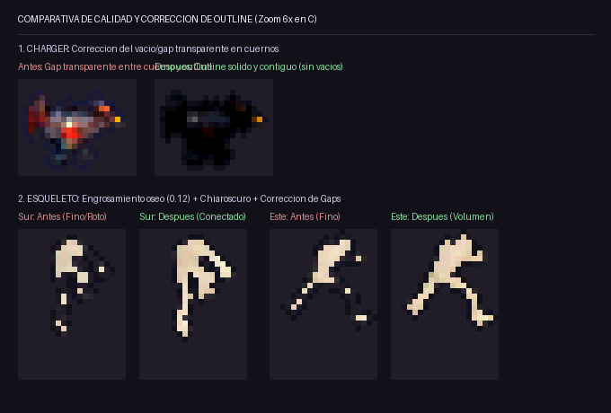
*Figura 2.1: Comparativa en simulación directa de renderizado C (Nintendo DS 15-bit). Arriba: cuernos del Charger antes (con franja vacía/gap) vs después (outline contiguo y sólido). Abajo: esqueleto en vistas Sur y Este antes (blanco plano, huesos rotos) vs después (volumen calibrado, chiaroscuro gótico y contorno nítido).*

### 2.2. Barrido Calibrado de Grosor Óseo (Displacement Sweep a 4x)

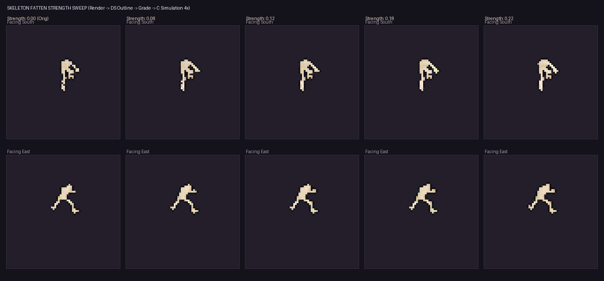
*Figura 2.2: Estudio de calibración de grosor (`strength = 0.00` a `0.22`). El valor `0.12` fue seleccionado por garantizar la conectividad de píxeles en extremidades sin perder la separación anatómica entre brazos y caja torácica.*

### 2.3. Ejecución en Consola (Capturas DeSmuME a 4x)

| Enemigo Cargador (Outline Sólido) | Enemigo Esqueleto (Volumen y Sombra) |
| :---: | :---: |
| 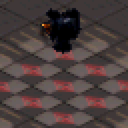 | 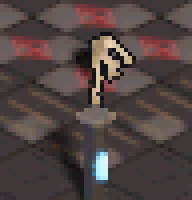 |
| *Charger en juego sin gaps en cuernos.* | *Esqueleto en juego con chiaroscuro y silueta legible.* |

---


### 2.4. Comparativas Animadas en las 8 Direcciones (Antes vs Después)

Collages interactivos de 8 direcciones sincronizados a cadencia natural (80-100 ms/frame), mostrando en paralelo la versión con erosión de contorno frente a la versión definitiva con dilatación anti-erosión y sombreado chiaroscuro:

#### 1. Enemigo Cargador (Run.fbx): Cuernos y Silueta en Carrera
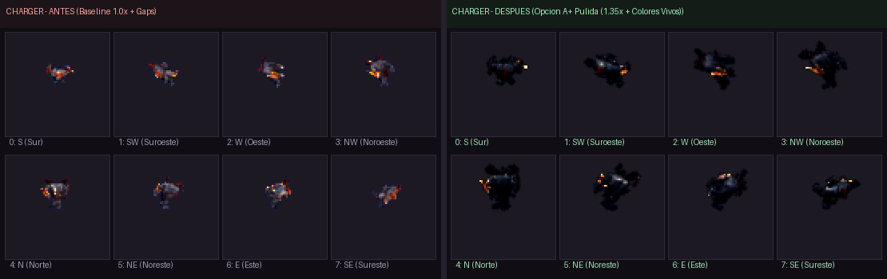
*Figura 2.3: Comparativa animada del Cargador en las 8 direcciones. Izquierda: cuernos erosionados y corte transparente frente al outline. Derecha: cuernos sólidos contiguos y masa muscular compacta.*

#### 2. Enemigo Esqueleto (skeleton.fbx): Estructura Ósea y Chiaroscuro Dramático
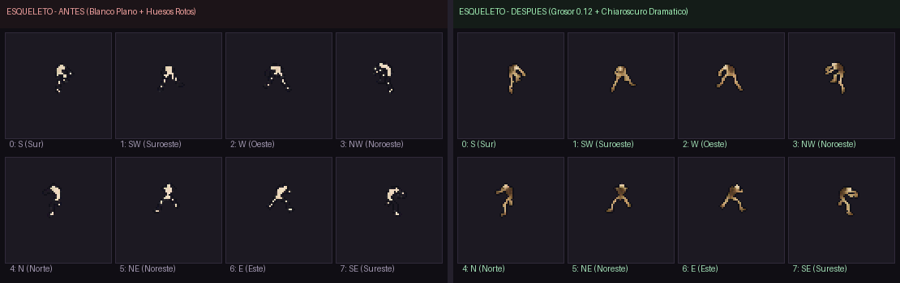
*Figura 2.4: Comparativa animada del Esqueleto en las 8 direcciones. Izquierda: silueta blanca plana original con extremidades rotas. Derecha: huesos conectados (grosor 0.12), cavidad torácica profunda y chiaroscuro gótico dinámico al girar.*

#### 3. Héroe Nigromante (Walking.fbx): Anti-Erosión Perimetral
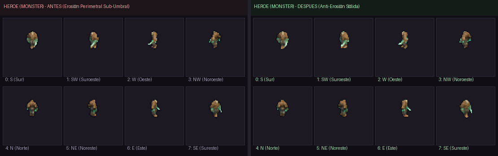
*Figura 2.5: Comparativa animada del Héroe en las 8 direcciones con borde recuperado al 100% contra el fondo abisal.*

---

## 3. Evidencia de Ejecución en Nintendo DS

### 3.1. Ciclo de Conmutación en Juego (Héroe -> Cargador -> Esqueleto)

El escenario `character_switch_test.json` recorre de forma interactiva los tres personajes en la Nintendo DS:

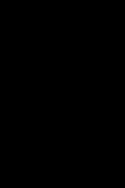

*Figura 2.1: Conmutación en tiempo real en la consola Nintendo DS ejecutándose en DeSmuME.*

### 2.2. Detalle a 4x del Esqueleto en la Cripta


*Figura 2.2: Sprite renderizado a resolución nativa NDS escalado a 4x. Obsérvese la legibilidad de la caja torácica, cráneo y piernas sobre el suelo oscuro junto a su sombra de contacto calculada en Cycles.*

Comparativa de escala con los otros dos personajes:
- **Héroe (Monster)**:  
  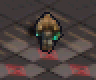
- **Cargador (Charger)**:  
  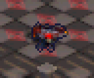

### 2.3. Spritesheet Horneado y Sombra 3D

- **Spritesheet 8x8 (8 direcciones x 8 frames):**  
  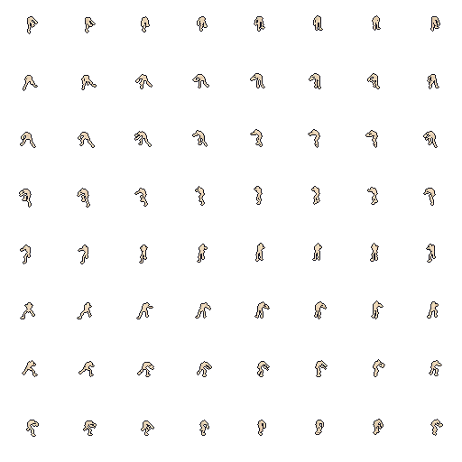
- **Máscara de sombra Cycles proyectada:**  
  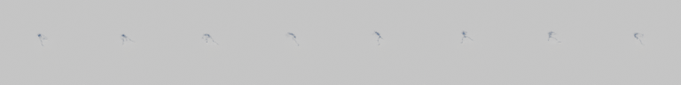

---

## 3. Estructura Limpia de Directorios

Tras la reorganización canónica, la jerarquía de assets queda perfectamente clasificada:

```
dungeonds/
├── assets/
│   ├── characters/
│   │   ├── charger/         # Run.fbx, texturas PBR, spritesheets e30/e60
│   │   ├── monster/         # Walking.fbx, spritesheets e30/e60
│   │   └── skeleton/        # skeleton.fbx, spritesheet e30 y sombras
│   ├── dungeon_e30/         # Sprites de escenario a 30°
│   ├── dungeon_e60/         # Sprites de escenario a 60°
│   ├── dungeon_tiles/       # Tiles base de suelo y muros
│   ├── tests_and_previews/  # Capturas históricas, gifs comparativos y tests
│   └── docs_references/     # Documentos y diagramas de referencia
├── include/                 # Cabeceras C (dungeon_data.h, player_sprite.h)
├── source/                  # Código fuente C Nintendo DS
├── tools/                   # Herramientas de horneado y conversión
│   └── lab/                 # Laboratorios interactivos HTML
└── walkthroughs/            # Registros auditables de cada sesión
```

---

## 4. Verificación de Tests y Toolchain

- **Tests unitarios de sombras (`tests/test_shadow_masks.py`):** `PASS` (2/2 pruebas superadas).
- **Compilación BlocksDS Docker (`scripts/build-project.ps1`):** `PASS` (ROM `dungeonds.nds` generada limpiamente sin warnings de memoria).
- **Escenario DeSmuME (`scenarios/character_switch_test.json`):** `PASS` (7 capturas, 25 eventos, screen change verificado).
