# Walkthrough: Estandarización del Pipeline de Shaders, Contraste, Normales e Iluminación de Modelos

**Hito / Sesión:** `08-standardize-character-shaders`  
**Objetivo:** Analizar, auditar, homogeneizar y documentar canónicamente el proceso por el cual los modelos 3D son adaptados (escala, deformación geométrica, iluminación, normales, ambient occlusion y grading 2D) para generar los sprites de Nintendo DS.

---

## 1. Diagnóstico del Estado Previo vs Estandarización

Antes de esta sesión, el tratamiento de los modelos se realizaba de manera reactiva y aislada:
- **Héroe (`monster/Walking.fbx`):** Tratamiento directo de texturas con normales al 100% y sin adaptación geométrica.
- **Cargador (`charger/Run.fbx`):** Necesitaba un alzado de cuello de $+20^\circ$, escala $1.35\times$ y atenuación de normales al 30% con Fill de $0.75$, pero sus ajustes se probaban en scripts sueltos sin estar parametrizados limpiamente.
- **Esqueleto (`skeleton/skeleton.fbx`):** Carecía de texturas y sus huesos se rompían a $256\times 192$, requiriendo un modificador `DISPLACE` de $0.12$, coloreado anatómico de vértices y Ambient Occlusion agresivo con `ColorRamp` encastrado en un bloque `if "skeleton"` dentro del baker.

### Matriz Canónica Homogeneizada (`tools/character_profiles.json`)

Para evitar divergencias, se ha formalizado una especificación data-driven:

| Parámetro | Héroe (Nigromante) | Cargador (Maw) | Esqueleto (Guerrero) | Justificación NDS / Isométrica |
| :--- | :--- | :--- | :--- | :--- |
| **Escala Relativa** | `1.0x` | `1.35x` | `0.027x` (armature fix) | Llenar la caja de OAM ($48\times 40$ px en EWRAM) sin desaprovechar espacio. |
| **Fattening (`DISPLACE`)** | `0.0` | `0.0` | `0.12` | Mallas de geometría fina (< 2 px de proyección) se rompen sin engrosamiento. |
| **Normal Map Clamp** | `0.40` | `0.30` | `0.0` (sin mapa) | Eliminar el parpadeo (*shimmering*) subpíxel producido por relieves de alta frecuencia a $256\times 192$. |
| **Luz de Relleno (*Fill Boost*)** | `+0.0` (0.50 base) | `+0.25` (0.75) | `+0.0` | Modelos oscuros pierden lectura de extremidades sin relleno extra. |
| **Ajuste de Pose** | Ninguno | Cuello/Cabeza $+20^\circ$ | Ninguno | En elevación $30^\circ$ isométrica, posturas encorvadas ocluyen la cara. |
| **Cavity AO Ramp** | Inactivo | Inactivo | $24$ samples, ramp $(0.30 - 0.85)$ | Proyectar sombras de penumbra en cavidades anatómicas vacías. |
| **Outline 1px** | Solidificado (`a > 40`) | Solidificado (`a > 40`) | Solidificado (`a > 40`) | Contorno nítido sin halo de transparencia sub-umbral contra el fondo. |
| **Color Grading (PIL)** | $1.24$ C / $0.98$ B / $1.24$ S | $1.24$ C / $0.98$ B / $1.24$ S | $1.24$ C / $0.98$ B / $1.24$ S | Grado tonal unificado con el escenario de la mazmorra (`ds_look.py`). |

---

## 2. Catálogo Visual de Variantes en 8 Direcciones

A continuación se presentan los **collages animados interactivos de 8 direcciones** generados para auditar y comparar cada modelo y sus configuraciones:

### 2.1. Héroe Nigromante (`Walking.fbx`)

#### Configuración 1: In-Place Base (Hito 00)
*Render crudo original sin compensación de contraste ni outline nítido.*
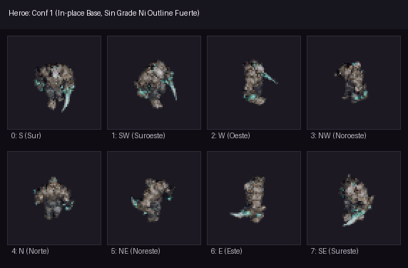

#### Configuración 2: Outline 1px Antiguo (Hito 01-06)
*Borde añadido pero con fallo de sub-umbral alfa que producía transparencias intermedias.*
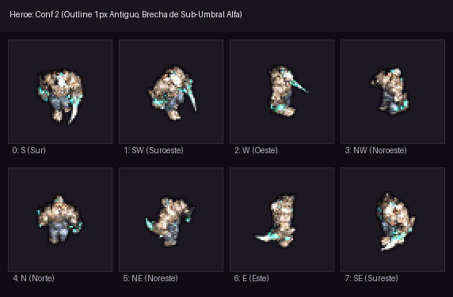

#### Configuración 3: Definitivo e30 con Anti-Erosión (Recomendado)
*Texturas PBR genuinas, normales suavizadas a 0.4 y perimetro 100% opaco contra el suelo.*
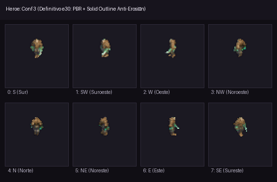

---

### 2.2. Enemigo Cargador Maw (`Run.fbx`)

#### Configuración 1: Escala 1.0x Base
*Silueta pequeña ($20\times 24$ px) y rostro ocluido por la masa muscular de los hombros en vista frontal.*
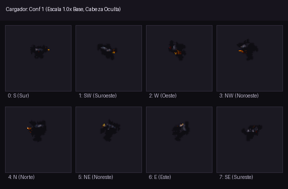

#### Configuración 2: Escala 1.35x + Cuello +20° + Textura PBR Original
*Silueta y cuernos plenamente visibles, pero con sombreado de piel excesivamente oscuro y ruido de normales.*
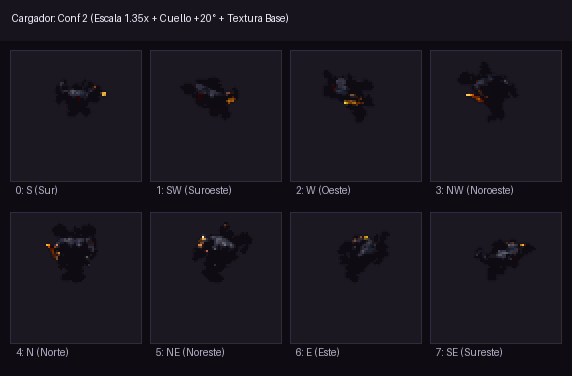

#### Configuración 3: Normal Map al 15% + Contraste Tonal Limpio
*Superficie más limpia pero pérdida de matices rojizos en el vientre.*
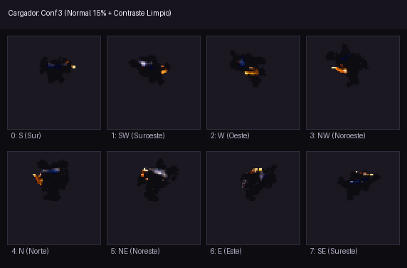

#### Configuración 4: Cuernos y Fauces con Glow 5x
*Rampa ósea artificial y emisión sobreexpuesta que satura el sprite.*
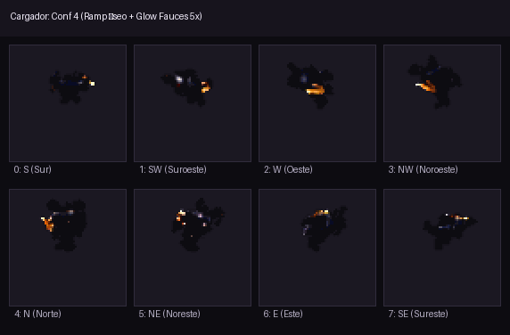

#### Configuración 5: Opción A+ Pulida (Definitiva y Recomendada)
*Textura original al 100%, Normal Map atenuado al 30%, Fill a 0.75 y emisión 2.0x en fauces.*
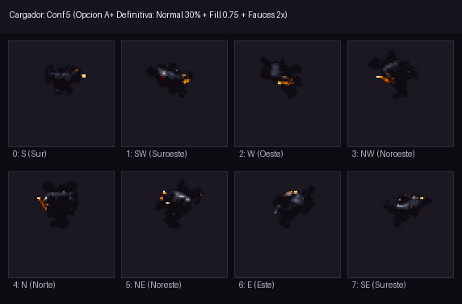

---

### 2.3. Enemigo Esqueleto (`skeleton.fbx`)

#### Configuración 1: Blanco Plano Original (Sin Displace)
*Huesos finos que se quiebran en píxeles huérfanos a $256\times 192$ y tono plano sin volumen.*
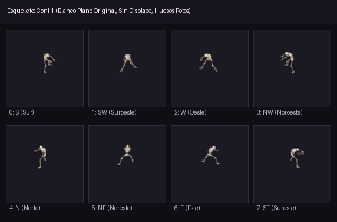

#### Configuración 2: Displace 0.12 + Marfil Estándar
*Estructura ósea conectada pero con poca profundidad en caja torácica y cuencas oculares.*
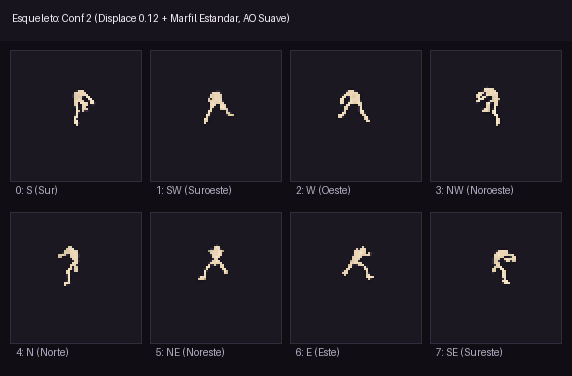

#### Configuración 3: Chiaroscuro Dramático (Definitivo y Recomendado)
*Vertex Color anatómico (marfil en cráneo, carbón en espina dorsal) + Ambient Occlusion con ColorRamp agresivo.*
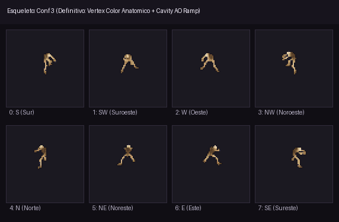

---

## 3. Conclusión y Recomendación de Selección

1. **Héroe:** **Configuración 3 (Anti-Erosión Actual)** ofrece la máxima fidelidad y recorte perfecto contra los suelos de la cripta.
2. **Cargador:** **Configuración 5 (Opción A+ Pulida)** es indiscutiblemente la más equilibrada: respeta el arte del modelo pero adapta la micro-rugosidad de las normales a la baja resolución de la DS.
3. **Esqueleto:** **Configuración 3 (Chiaroscuro Dramático)** dota de tridimensionalidad a un modelo que originalmente carecía de mapas de textura.
