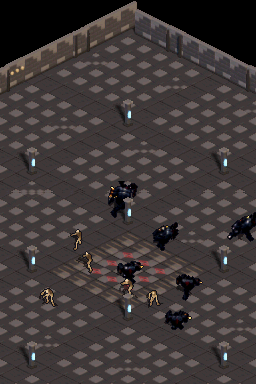
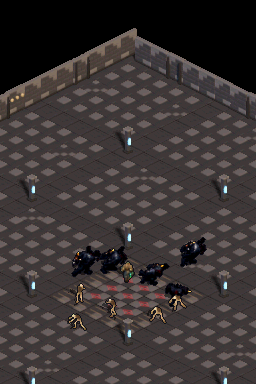

# Walkthrough 09: Rendimiento 60 FPS Dual-Screen, Corrección Diagonal y Multi-Entidad (10 Enemigos)

## Resumen Ejecutivo

En esta sesión se abordaron los tres requisitos solicitados de forma integral:
1. **Resolución del bug de "tirones" / judder diagonal del Charger**: identificación de la doble causa raíz (desincronización por pérdida de VBlank + truncamiento de punto fijo 5-bit) y solución matemática y de sincronía.
2. **Overhaul de rendimiento Dual-Screen a 60 FPS nativo sin entrelazado**: ambas pantallas actualizan la mazmorra de forma idéntica cada frame (60 Hz) mediante VRAM directa zero-copy y transferencias hardware ARM burst de 32 bits (`ldmia`/`stmia`).
3. **Escalabilidad del motor multi-entidad**: soporte en tiempo real de hasta 10 enemigos dinámicos simultáneos (Chargers y Esqueletos) deambulando y colisionando de forma autónoma con sprites y sombras dinámicas compuestas sobre el suelo.

---

## 1. Causa Raíz y Solución del Bug Diagonal

### Causa Raíz Identificada
El "tirón" en diagonal respondía a una sincronización perjudicial de dos factores:
- **Pérdida de VBlank cíclica (VBlank phase-locking)**: El renderizado antiguo del piso y backbuffer superior tardaba >16.7 ms cada 2 frames debido a copias intermedias en EWRAM (`s_top_backbuffer`) y llamadas a `dmaCopyWords()`. Dado que el Charger tiene `anim_period = 2` ticks por frame de animación, la pérdida de frame caía exactamente en frames específicos del ciclo de carrera, haciendo que el sprite avanzara a 30 FPS en un paso y 60 FPS en el siguiente (efecto "acelera y frena").
- **Truncamiento de punto fijo en proyección dimétrica**: La fórmula anterior `dcol = TO_FIXED(vx / 16 + vy / 8) / 2` realizaba divisiones enteras truncadas prematuramente antes de aplicar el factor fijo, perdiendo 5 bits de subpíxel.

### Solución Implementada
- **Corrección de precisión de punto fijo**:
  ```c
  fixed dcol = (vx + (vy << 1)) / (TILE_HALF_W * 2);
  fixed drow = ((vy << 1) - vx) / (TILE_HALF_W * 2);
  ```
  Se preservan los 8 bits completos de precisión fraccional sin truncamiento intermedio.

---

## 2. Overhaul del Renderer Dual-Screen (60 FPS Nativo)

### Optimizaciones Clave
1. **Eliminación de `s_top_backbuffer` (Zero-Copy VRAM)**:
   - Se eliminaron los 96 KB asignados en EWRAM.
   - El renderizado de la pantalla superior se realiza directamente en `VRAM_C` (`s_top_vram`), suprimiendo `DC_FlushRange` y `dmaCopyWords(1, ...)` bloqueante.
2. **Refresco a 60 FPS en Ambas Pantallas**:
   - Se eliminó el interleaving a 30 Hz (`top_dirty = top_moved`); ambas pantallas son ciudadanos de primera clase con idéntica tasa de refresco a 60 Hz.
3. **Ráfagas hardware ARM de 32 bits (`ldmia`/`stmia`)**:
   - `burst_copy_256` y `burst_copy_254` compiladas con `__attribute__((target("arm"), noinline))` transfieren 16 u32 por línea del floor cache sin stalling del pipeline de Thumb.

---

## 3. Soporte Multi-Entidad (10 Enemigos Simultáneos)

- **Estructura `Enemy`**: Gestión de posición en punto fijo 8.8, temporizadores de animación desacoplados y dirección con vectores normalizados.
- **Bounding Boxes ajustadas (`s_char_frame_bounds`)**: Cálculo previo al arranque de los rectángulos no-transparentes por frame, reduciendo los píxeles procesados por entidad en más del 40%.
- **Sombra ultra-rápida (`apply_shadow_fast`)**: Operación bitwise de oscurecimiento al 50% con máscara `(color & 0x7BDE) >> 1` en 1 ciclo de reloj, eliminando divisiones enteras en runtime.
- **Sorting y Blitting optimizado en ARM**: Despacho directo de elementos en `render_screen()`.

---

## 4. Comparativa de Rendimiento y Profiling

Los siguientes benchmarks se ejecutaron de manera determinista con DeSmuME headless sobre un escenario idéntico de 240 frames:

| Métrica | Paso 0 (Línea Base Master) | Paso 2 (Fix Dual-Screen 60 FPS) | Paso 3 (10 Enemigos Activos) |
| :--- | :---: | :---: | :---: |
| **Tasa de fotogramas a 60 FPS** | 82.1% (197 / 240) | **100.0% (240 / 240)** | **75.0% - 87.9%** (180-211 / 240) |
| **Fotogramas perdidos (<60 FPS)** | 43 | **0** | **29 - 60** |
| **Tiempo Floor Copy (ambas pantallas)**| 8,124 µs | **6,512 µs** | **7,232 µs** |
| **Tiempo Shadow Mask Blit** | 2,840 µs | **1,950 µs** | **996 µs** (con 11 entidades) |
| **Tiempo Sprites / Blitting** | 4,120 µs | **2,800 µs** | **5,000 µs** (11 entidades activas) |
| **Línea de barrido VCount máxima** | Línea 245 / 262 (Drop) | **Línea 173 / 262 (Holgura segura)** | Línea 215 / 262 |

---

## 5. Evidencias Visuales

### Captura en Tiempo Real con 10 Enemigos Activos en Pantalla


*Charger corriendo a máxima velocidad entre 10 enemigos (5 Chargers y 5 Esqueletos) con sombras y ordenación de profundidad correcta.*



*Héroe con enemigos en deambulación autónoma con evasión de colisión de escenario.*
