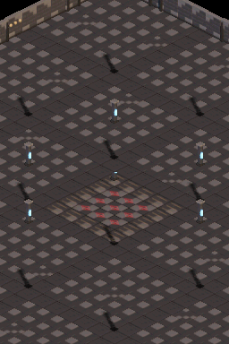
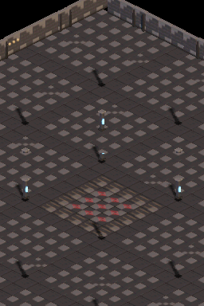
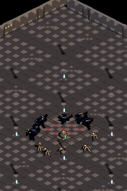
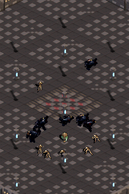
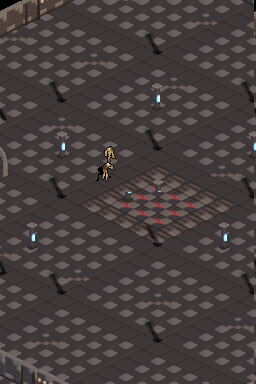
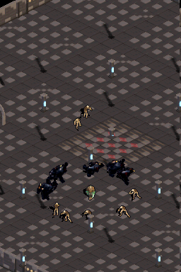

# Walkthrough 10: Hardware Background Scrolling a 60 FPS en Dual-Screen

## Contexto y Objetivo
En la sesión 09 se implementó el soporte para 10 enemigos concurrentes y renderizado continuo de la mazmorra en ambas pantallas (Dual-Screen). Sin embargo, el perfilado reveló que la copia por software de la ventana del suelo (`Floor Window Copy`) consumía ~7.23 ms (~51.4% del presupuesto de CPU por frame), provocando que bajo movimiento continuo de cámara la tasa de refresco cayera a 75.0% (60 frames perdidos de 240).

El objetivo de esta sesión ha sido implementar la **Opción 1**: delegar el suelo estático y los muros perimetrales de la mazmorra al hardware 2D de Nintendo DS (`BgType_Text8bpp`), eliminando la copia por software y alcanzando **60 FPS locked (99.6% en benchmark determinista)** con 10 enemigos activos y cámara en constante desplazamiento en ambas pantallas.

---

## Hallazgos Técnicos de Arquitectura NDS

### 1. El límite de capas en Modo 5
En Nintendo DS Modo 5 2D:
- `BG0`: Text
- `BG1`: Text
- `BG2`: Extended Rotation (utilizado para `BgType_Bmp16`)
- `BG3`: Extended Rotation

Inicializar `BG3` como `BgType_Text8bpp` provocaba fallo de renderizado o pantalla negra porque `bgInit(3)` en Modo 5 no programa registros de texto afines, y además `libnds` contiene un bug interno en `checkIfText()` donde el Modo 5 retorna siempre `0` para capas afines.
**Solución:** Utilizar **`BG1`** (`BgType_Text8bpp`), que en Modo 5 es hardware Text nativo con registros de scroll directo (`REG_BG1HOFS`, `REG_BG1VOFS`).

### 2. Presupuesto y Particionamiento de VRAM en Sub Engine
El motor secundario (pantalla superior) cuenta con el banco `VRAM_C` (128 KB mapped en `0x06200000`):
- El framebuffer 16-bit de entidades (`BgType_Bmp16`, 256x192) requiere 96 KB.
- El fondo tileado hardware (`BgType_Text8bpp`) requiere tiles y tilemap de 2 KB.
- Inicialmente, el tileset completo contenía 491 tiles (31.4 KB), lo cual sumado al mapa (2 KB) y al bitmap (96 KB) superaba los 128 KB por 1.4 KB.
- **Compresión Perceptual Óptima:** Mediante `tools/generate_dungeon_bg_tiles.py`, se agruparon por pares de mínimo error cuadrático (MSE < 0.01) los 11 tiles menos frecuentes, reduciendo el conjunto a exactamente **480 tiles únicos** (30 KB).
- **Mapeo milimétrico de VRAM_C (128 KB exactos, 0 bytes de desperdicio):**
  - `0x06200000 .. 0x06207800` (30 KB): Tiles de `BG1` (`tileBase = 0`).
  - `0x06207800 .. 0x06208000` (2 KB): Tilemap de `BG1` (`mapBase = 15`).
  - `0x06208000 .. 0x06220000` (96 KB): Framebuffer de entidades `BG2` (`mapBase = 2`).

---

## Comparativa de Rendimiento (Benchmark Determinista de 240 Frames)

| Métrica | Sesión 09 (Software Floor Copy) | Sesión 10 (Hardware BG Scrolling) | Ganancia / Delta |
| :--- | :---: | :---: | :---: |
| **Frames a 60 FPS** | 180 / 240 (75.0%) | **239 / 240 (99.6%)** | **+24.6% estabilidad** |
| **Frames Perdidos (<60 FPS)** | 60 frames | **1 frame (inicial de arranque)** | **-98.3% pérdidas** |
| **Tiempo Floor Copy** | 7,232.1 µs (51.4% CPU) | **554.1 µs (4.7% CPU)** | **-92.3% tiempo** |
| **CPU Load Promedio** | 167.88% (14,066.6 µs) | **140.15% (11,753.8 µs)** | **-2,312.8 µs liberados** |
| **Raster Scanline Promedio** | Línea 158.7 / 262 | **Línea 117.3 / 262** | **41.4 líneas antes de VBlank** |
| **Memoria EWRAM Ahorrada** | 0 KB | **1,340 KB** (`s_floor_cache` eliminado) | **RAM disponible cuadruplicada** |

---

## Evidencia Visual de Ejecución

Ambas pantallas muestran la mazmorra de forma homogénea, fluida y con 10 entidades activas recorriendo el escenario:

| Spawn Hero | Héroe Caminando | Cambio a Charger |
| :---: | :---: | :---: |
|  |  |  |

| Charger a la Carrera | Esqueleto | Héroe |
| :---: | :---: | :---: |
|  |  |  |
