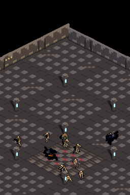
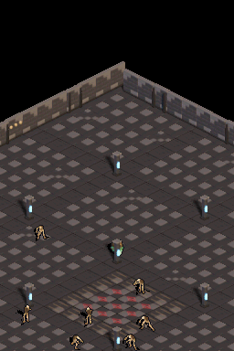
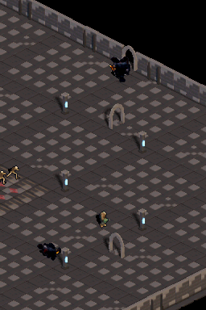
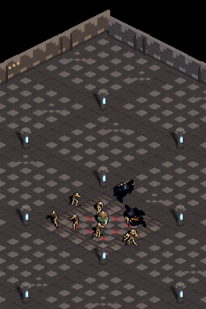

# Walkthrough 11: Background Tile Streaming, Stutter Analysis & Pillar/Arch Alignment

## 1. Alcance y estado

- Rama: `perf/background-scroll-and-rendering`.
- Worktree: `.worktrees/perf-bg-scroll-render`.
- Objetivos: quitar tirones al desplazar la cámara, eliminar seams/tearing y corregir la alineación visual de pilares y arcos.
- Estado: completado en emulación; streaming, memoria VRAM y métricas corregidos. Los escenarios de desplazamiento, pilares y unión de muros pasan; no se reproduce el desfase visual reportado a resolución nativa.

## 2. Diagnóstico

- BG1 estaba configurado como 256×256 (32×32 tiles), insuficiente para 256 px visibles con scroll sub-tile: hacen falta hasta 33 columnas.
- Se copiaban 32×25 entradas del tilemap a VRAM activa cada frame, antes de VBlank. Al cruzar límites de tile, el contenido y los offsets podían pertenecer a cámaras distintas.
- BG 512×256 organiza el mapa en dos screenblocks 32×32; escribirlo como una matriz lineal 64×32 produjo huecos y fragmentos repetidos en la primera captura posterior al cambio.
- El tileset superior ocupaba 30 KiB y el framebuffer empieza en VRAM_C + 32 KiB; un mapa 64×32 necesita 4 KiB. El bloque disponible se solapaba 2 KiB.
- Muros perimetrales se hornean en el fondo; pilares/arcos y sus sombras se dibujan en runtime/suelo. El escenario de esquina sirve para inspección visual de sus uniones.

## 3. Cambios implementados en el worktree

- BG1 ahora es 512×256 (64×32), con mapa circular, scroll combinado de origen circular + sub-tile y un índice físico que respeta los dos screenblocks de 32×32.
- El mapa se inicializa una vez; al mover la cámara sólo se rellenan filas/columnas nuevas. Las escrituras al mapa y registros de scroll ocurren en VBlank.
- Para VRAM_C, el generador limita el tileset a 448 tiles (28 KiB); el mapa superior ocupa 4 KiB desde offset 0x7000 y termina antes del framebuffer en 0x8000. El generador produjo 448 tiles (42 fusiones).
- La regeneración conserva CACHE_Y0 = -96 y coloca cada suelo en `(col + row) * 8 - 8`. La revisión del GIF de 170 frames no mostró huecos ni seams durante el scroll.
- El benchmark actualizado cuenta el streaming dentro de los ticks de suelo/CPU, usa el presupuesto completo de 560,190 ciclos por frame y apunta al símbolo actual de telemetría.

## 4. Verificación y evidencia

- `scripts/build-project.ps1 -ProjectPath .`: PASS con BlocksDS `skylyrac/blocksds:slim-latest`; ROM `dungeonds.nds` (CRC `03AE614F`).
- `tools/measure_perf.py`: 240/240 frames a 60 FPS; CPU 48.95% promedio/53% máximo; stream de fondo 26.8 µs promedio.
- `scenarios/dual_screen_ruins_test.json`: PASS, 6 capturas de estado/17 eventos y 170 frames consecutivos durante el movimiento en cuatro direcciones. La transición inicial informó 55,442 píxeles distintos.
- `scenarios/pillar_collision_test.json`: PASS, 5 capturas/21 eventos.
- `scenarios/wall_junction_closeup.json`: PASS, 4 capturas/10 eventos; esquina y arcos revisados a resolución nativa.
- Las capturas y sus manifests/logs están en `assets/validation-dual-screen/`, `assets/validation-pillars/`, `assets/validation-walls/` y `assets/validation-scroll-gif/`; el GIF está en `assets/camera-scroll-four-directions.gif`.

- `scripts/run-host-tests.ps1 -ProjectPath .`: SKIP; `.ds-game-dev/project.json` declara `hostTests: []`.
- La inspección de esquina y pilares no muestra un desfase reproducible de anclas/sombras; suelo, objeto y máscara comparten el mismo centro proyectado. No se aplicó un cambio de geometría sin defecto visible.
- `graphify update .` quedó bloqueado por la allowlist de lean-ctx.

| Scroll en 4 direcciones | Colisión con pilares | Unión de muro/arco |
| :---: | :---: | :---: |
|  |  |  |

### Recorrido continuo de cámara

El GIF usa 170 frames reales del runner de DeSmuME, capturados durante el movimiento hacia norte, este, sur y oeste; permite revisar el scroll entre estados, incluidos los cruces de tiles.

## 5. Cierre

- El GIF y las capturas corresponden al ROM final (CRC `03AE614F`) y están enlazados desde esta carpeta. La emulación valida el flujo de render; no sustituye una medición en una consola física.
