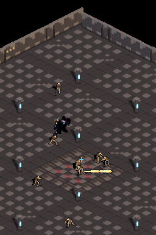
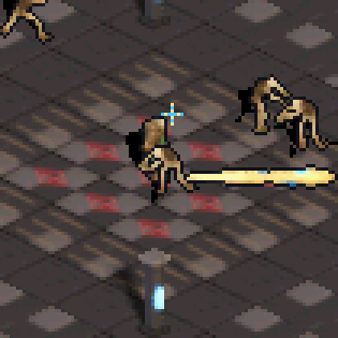
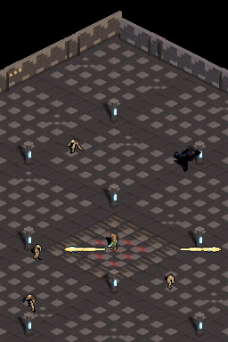

# Prototipo de combate: Lanza ósea

## Objetivo

Probar si una habilidad de apuntado instantáneo produce combate legible y dinámico en la mazmorra actual, sin animación nueva del personaje ni un árbol de habilidades. La lanza se genera en Blender con el preset e30 del proyecto y se convierte a BGR555 para el renderizador de DS.

## Controles

- **A mantenido:** dispara automáticamente hacia el enemigo activo más cercano.
- **Lápiz mantenido en la pantalla inferior:** dispara en la dirección del punto tocado. Tiene prioridad sobre A.
- **Cruceta:** mueve al personaje. X, Y y SELECT conservan el cambio de personaje para pruebas.
- Al lanzar, el héroe conserva su pose quieta; solo cambia el facing para apuntar.

## Números de prueba

| Elemento | Valor inicial |
| --- | ---: |
| Lanza ósea | 30 de daño |
| Esqueleto | 40 PV (2 impactos) |
| Charger | 90 PV (3 impactos) |
| Cadencia | 16 frames (aprox. 0,27 s) |
| Velocidad | 4 px proyectados/frame |
| Perforación | atraviesa objetivos distintos; cada enemigo recibe un impacto por proyectil |

No hay daño al jugador, animación de casteo ni reanimación todavía. Estos valores son hipótesis para probar sensación y ritmo.

## Feedback visual

El proyectil es un sprite 3D horneado en ocho direcciones con el look compartido. Tiene silueta de hueso marfil, contorno oscuro y destello espectral; el impacto genera una cruz breve cian/marfil. La escena es la mazmorra existente y mantiene los personajes actuales.

## Evidencia de prueba

- scenarios/bone_lance_button_contract.json: A fue consumido por la ROM; la captura muestra la lanza en vuelo y el héroe quieto.
- scenarios/bone_lance_touch_contract.json: un toque en (194, 80) produce un disparo hacia la derecha, dentro del área táctil de la pantalla inferior; se libera el lápiz después.
- scenarios/bone_lance_combat_test.json: mantener A 120 frames hace que el autoapuntado dispare repetidamente y elimina varios enemigos.
- Contrato host: verifica las ocho orientaciones, los números provisionales de impactos y que A/lápiz estén conectados al disparo.

## Validación

- scripts/build-project.ps1: PASS, ROM artifacts/bone-lance/game.nds.
- scripts/run-host-tests.ps1: PASS, 3 contratos.
- Los tres escenarios DeSmuME: PASS; capturas inspeccionadas a resolución nativa y ampliadas.
- No probado en consola física.

## Archivos principales

- tools/bake_bone_lance.py
- assets/effects/bone_lance/bone_lance_e30.png
- include/bone_lance_sprite.h
- source/bone_lance_sprite.c
- source/main.c
