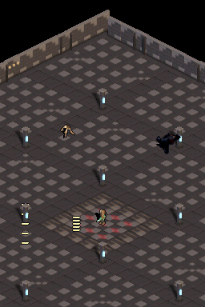
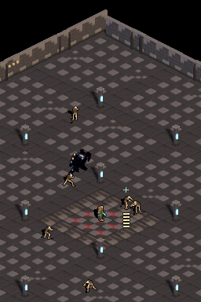

# Hito 13: Perdigones de hueso

## Objetivo

Ajustar la lanza ósea del prototipo a una escala pequeña, puntiaguda y legible, y convertir el disparo en una salva sencilla tipo escopeta.

## Resultado

- El proyectil sigue siendo un modelo 3D de hueso afinado, horneado a una spritesheet transparente de 8 direcciones y convertido a BGR555 para Nintendo DS. No se instancia geometría 3D en tiempo de juego: el motor mueve y dibuja sprites.
- La malla mide 2,05 m antes de escalarse; la escala de horneado 0,44 deja el asta en aproximadamente **0,90 m**. El cuadro de 64×64 conserva transparencia y el contenido opaco ocupa como máximo 12×12 px.
- A o el lápiz disparan **5 astillas** en un abanico de unos ±14°. Cada una viaja rápido y puede golpear una vez a cada enemigo.
- Daño: 10 por astilla; vida: esqueleto 40 y cargador 90. Un impacto cercano con los cinco perdigones suma 50: puede matar al esqueleto de una salva y requiere dos salvas para el cargador.
- Cadencia: una salva cada 16 frames. El máximo simultáneo del pool es 16 proyectiles; con 5 por salva y vida máxima de 40 frames caben tres salvas (15).

## Controles

- Mantener **A**: apunta automáticamente al enemigo más cercano.
- Mantener el lápiz en la pantalla inferior: dispara hacia el punto tocado y prevalece sobre A.
- El personaje permanece quieto durante el disparo, como en el prototipo anterior.

## Evidencia visual

## Verificación

- `scripts/check-toolchain.ps1`: PASS.
- `scripts/run-host-tests.ps1 -ProjectPath .`: PASS (3 contratos: 8 direcciones/tamaño, escala/daño/salva y rutas de apuntado).
- `scripts/build-project.ps1 -ProjectPath . -OutputRom artifacts/bone-shotgun/game.nds`: PASS con Docker BlocksDS.
- Escenarios `bone_lance_button_contract.json`, `bone_lance_touch_contract.json` y `bone_lance_combat_test.json`: PASS en DeSmuME headless.
- Sin validación en consola física.

## Alcance deliberado

El abanico, el daño y la cadencia son números de prueba para que la sensación del disparo sea comprobable. El efecto conserva un spritesheet estático por dirección; no hay animación del personaje ni progresión persistente.
