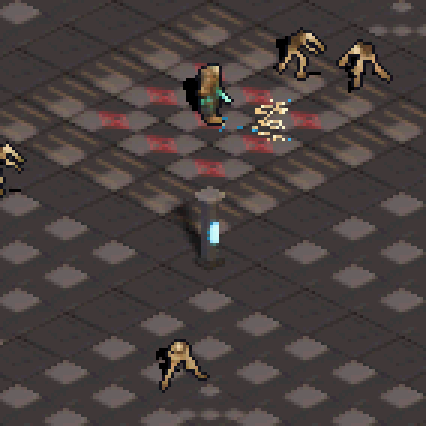

# Hito 14: Lanza ósea procedural

## Objetivo

Reemplazar el spritesheet repetido por una silueta de astilla dibujada en runtime y generar un GIF real del disparo en movimiento para revisar su lectura visual.

## Implementación

- Cada perdigón se rasteriza en el framebuffer como una línea ósea estrecha de 8–11 píxeles, con punta clara, pequeñas barbas ocasionales y leves irregularidades. No hay outline ni textura horneada.
- Las cinco astillas reciben semillas distintas, así varían longitud, irregularidad y destello.
- Cada proyectil emite motas de alma con cadencia pseudoaleatoria. Un pool de 32 partículas conserva posición y deriva en 8.8, tono y tamaño; viven entre 4 y 7 frames.
- El pool de proyectiles, la velocidad, el abanico, daño y colisiones no cambian: son efectos dibujados en BGR555, sin geometría 3D ni entradas OAM.
- `tools/make_capture_gif.py` acepta recorte, escalado nearest-neighbor y omisión de capturas iniciales para generar un GIF de DeSmuME centrado en el efecto.

## GIF de movimiento

Captura de 28 frames del juego real con A mantenida; se omiten las cuatro primeras capturas del inicio del disparo. Se recortó la pantalla inferior y se amplió con nearest-neighbor para inspeccionar los píxeles.

## Verificación

- `scripts/check-toolchain.ps1 -ProjectPath .`: PASS.
- `scripts/run-host-tests.ps1 -ProjectPath .`: PASS (3 contratos de raster procedural, variación de semilla, números y controles).
- `scripts/build-project.ps1 -ProjectPath . -OutputRom artifacts/bone-particle-trails/game.nds`: PASS con Docker BlocksDS.
- `bone_particle_motion_preview.json`: PASS; A mantenida 32 frames, 32 capturas secuenciales y cambio de pantalla comprobado.
- Escenarios de A, lápiz y fuego sostenido: PASS en DeSmuME.
- Sin validación en consola física.

## Decisión visual pendiente

El GIF es una primera iteración para evaluar escala, silueta y ritmo de las motas. La legibilidad final y el gusto por la forma todavía requieren revisión visual humana.
