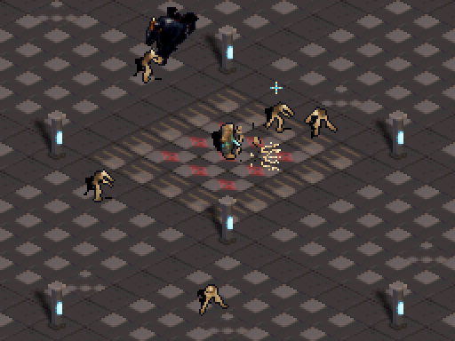
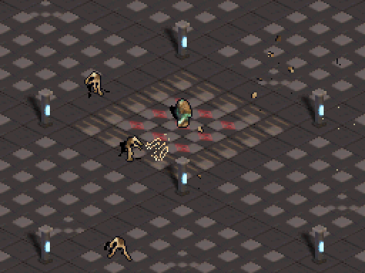

# Hito 15: Lanza ósea rápida y fragmentación al morir

## Objetivo

Quitar el azul del rastro de la salva, acelerar los proyectiles y prototipar el desmembramiento en la muerte de los enemigos usando la idea de TowerDS.

## Qué tomé de TowerDS

En TowerDS, el efecto conserva los píxeles y colores del enemigo al desprender fragmentos, les aplica una física corta y deja que vuelvan al suelo. Aquí apliqué esa lectura sólo al golpe final: todavía no hay heridas ni amputaciones parciales durante los impactos normales.

Cada enemigo muerto deja hasta seis parches de 4×4 copiados de su frame actual. Mantienen los colores originales del sprite, salen con un pequeño impulso en la dirección del disparo y describen un arco con gravedad en punto fijo. El renderer los ordena por profundidad y dibuja una sombra mínima debajo. Un pool fijo de 48 fragmentos mantiene el coste acotado.

## Cambios de la lanza

- Velocidad de proyectil duplicada: 4 → 8 píxeles proyectados por frame.
- Se conserva el abanico, el daño y la cadencia.
- Eliminados los tonos cian de las motas y del destello de punta; la paleta del efecto ahora es marfil/hueso.
- Sin sprites nuevos ni entradas OAM.

## Evidencia visual

GIFs generados desde capturas reales de DeSmuME; ambos ampliados con nearest-neighbor para revisar la lectura a resolución nativa.

### Salva rápida

### Muerte y fragmentos

## Verificación

- `scripts/build-project.ps1 -ProjectPath . -OutputRom artifacts/bone-particle-deaths/game.nds`: PASS, Docker BlocksDS.
- `scripts/run-host-tests.ps1 -ProjectPath .`: PASS (3 contratos).
- DeSmuME: `bone_particle_motion_preview.json`, `bone_lance_button_contract.json`, `bone_lance_touch_contract.json`, `bone_lance_combat_test.json` y `bone_dismemberment_preview.json`: PASS.
- Sin validación en Nintendo DS física.

## Alcance del prototipo

La muerte separa pequeñas regiones del sprite original; no modela todavía miembros anatómicos ni heridas parciales. El siguiente ajuste visual debería partir de la legibilidad de estos fragmentos en movimiento.
