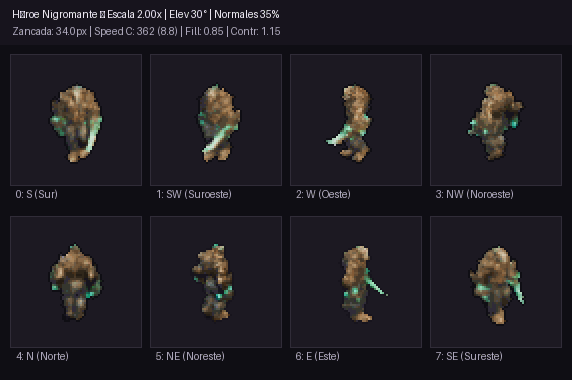
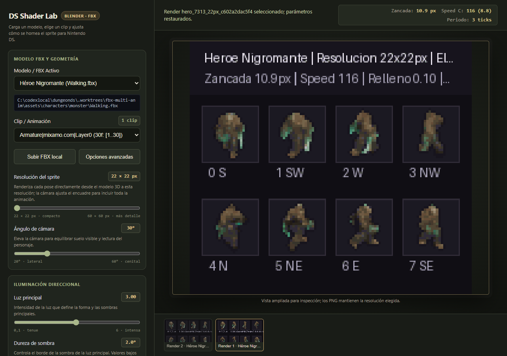
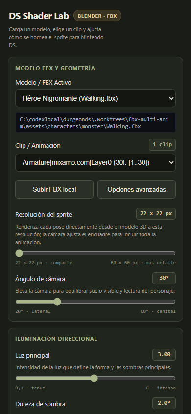
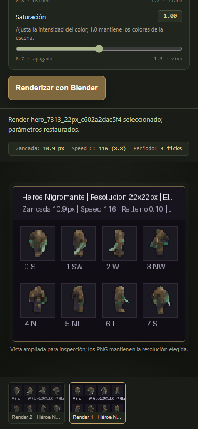
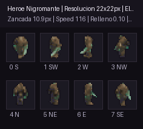

# Sesión 16: DS Shader Lab Interactivo y Pipeline FBX Abierto

## Resumen Ejecutivo

En esta sesión se desarrolló una herramienta interactiva local para tuning de modelos 3D, iluminación Cycles y post-proceso 2D con renderizado continuo y acoplamiento cinemático para Nintendo DS, además de resolver el centrado de cámara y la selección abierta de modelos FBX.

---

## 1. Problema Diagnosticado

1. **Descentrado Vertical y Recorte Superior:**
   - La cámara isométrica enfocaba originalmente a `(0, 0, 0)` (nivel del suelo).
   - Debido al levantamiento por frame del rig para apoyar los pies en el plano de tierra, el centro de gravedad del personaje quedaba desplazado hacia arriba respecto al centro de encuadre ($Y=32$).
   - A escalas superiores a 1.40× (y especialmente a 2.00×), la cabeza superaba el margen superior ($Y < 0$) y se cortaba.
2. **Dependencia de Lista Cerrada de Modelos:**
   - Previamente, el pipeline admitía únicamente los 3 presets codificados a fuego (`hero`, `charger`, `skeleton`).

---

## 2. Solución e Implementación

### 2.1 Corrección de Centrado Vertical de Cámara
En `tools/lab/shader_lab_server.py`:
- Se evalúa dinámicamente la altura del modelo tras la deformación (`_char_height`).
- Se sitúa `CamTarget` en el punto medio vertical simétrico del personaje:
  $$\text{target\_z} = \text{char\_height} \times 0.50$$
- Se ajusta la posición de la cámara isométrica para conservar la inclinación canónica de 30° con el nuevo centro.
- **Resultado:** A escala 2.00× en el lienzo de 64×64, la cabeza se mantiene perfectamente dentro de los márgenes ($Y \in [11, 56]$ para el héroe y $[8, 56]$ para el esqueleto), sin ningún recorte.

### 2.2 Selector Dinámico y Subida de FBX
- **Descubrimiento automático:** El endpoint `/api/config` y `/api/fbx-files` escanea recursivamente `assets/` detectando todos los archivos `.fbx`.
- **Subida vía Web:** Botón nativo `📁 Subir FBX Local` en la interfaz (`tools/lab/shader_lab_ui.html`) con subida Base64 al endpoint `/api/upload-fbx` (guardado en `assets/characters/custom/`).
- **Parámetros avanzados configurables:**
  - Armature Scale (p. ej. `0.027` para rigs Maya/Mixamo de esqueletos o `1.0` para escala métrica).
  - Inclinación de cuello (`neck_pitch`): el lab detecta el eje lateral del hueso en reposo y elige X o Z local según el rig; el signo permite invertir el sentido.
  - Fattening/Displace óseo.
  - Selección de shader (PBR estándar vs Shader óseo limpio).
  - Zancada 3D y periodo de animación acoplados al speed fixed-point 8.8.

### 2.3 Resolución solicitada y encuadre animado
- El control de tamaño ahora expresa píxeles de salida (22–60 px), con 48 px como valor inicial, en vez de un multiplicador de cámara.
- Blender evalúa los vértices deformados del modelo en los 64 casos (8 frames × 8 direcciones), proyecta su caja conjunta y ajusta la escala ortográfica de cámara antes de renderizar.
- Cada pose se renderiza directamente desde el modelo 3D a la resolución pedida, entre 22×22 y 60×60; PIL ya no escala los PNG después del render.
- El tamaño indicado incluye el contorno. La caja final queda a ±1 px del objetivo por rasterización.
- Comparación de ROM a través de las 64 poses opacas: héroe hasta `18×23 px`, cargador `32×36 px`, esqueleto `19×22 px`. Para reproducir en el lab la ocupación máxima actual, usar `23 px`, `36 px` y `22 px`, respectivamente.
- El importador FBX puede colocar mapas con nombre `metallic` y `roughness` en sockets Principled incorrectos. El lab ahora los reasigna por nombre, configura mapas de datos como `Non-Color` y usa un entorno neutro para que los reflejos metálicos no salgan negros.
- `Ticks por frame` fija la duración de preview a `ticks/60 s`; la velocidad 8.8 se calcula con el mismo periodo para conservar la zancada. El ajuste de cuello se reaplica después de evaluar cada frame, elige Neck o usa Head si falta, y detecta el eje lateral X/Z local del rig.
- Verificación a 32×32: los PNG raw y procesados miden realmente 32×32; las cajas conjuntas visibles fueron `31×32` (`Walking.fbx`), `32×30` (`Run.fbx`) y `30×32` (`skeleton.fbx`).
- El GIF de vista previa amplía cada celda con nearest-neighbor solo para inspección; conserva la resolución nativa elegida en los PNG.
- La distancia de cámara es fija porque la proyección ortográfica no depende de ella; `ortho_scale` se calcula desde la caja 3D conjunta de los vértices animados.
- La zancada conserva el factor cinemático histórico de cada preset y escala proporcionalmente con el tamaño solicitado.

### 2.4 Historial de renders y parámetros
- Cada render recibe un identificador único y guarda sus PNG/GIF en una carpeta propia; los cambios de parámetros ya no sobrescriben salidas previas por compartir una clave incompleta.
- Las miniaturas conservan la instantánea de ajustes enviada al servidor. Al seleccionar un render anterior, la vista y los controles recuperan esos valores.
- Una ruta FBX editada manualmente se envía como modelo personalizado aunque el selector siga mostrando un preset.

### 2.5 Pasada final de interfaz
- Se sustituyó el 404 de vista previa por una pantalla vacía instructiva; el favicon ahora es local e inline.
- El collage se amplía para inspección y mantiene los PNG a su resolución nativa; sus títulos y direcciones caben también con celdas de 22 px.
- Historial operable con teclado, estados seleccionados anunciados, etiquetas asociadas a todos los controles avanzados y errores mostrados en línea.
- Validación visual en escritorio `1280×900` y móvil `390×844`; `scrollWidth` móvil igual a `390 px`, consola sin errores.
- Render real del héroe a `22×22 px`, 8 muestras; dos renders con luz ambiente `0.10` y `0.30` conservaron GIFs distintos y al volver al primero se restauró `0.10`.

---

## 3. Evidencia Visual

*Collage animado en 8 direcciones generado con el nuevo centrado vertical a escala 2.00×.*

---

## 4. Archivos Clave y Estado

- `tools/lab/shader_lab_server.py`: Servidor HTTP y orquestador de bakes headless en Blender Cycles.
- `tools/lab/shader_lab_ui.html`: Interfaz web interactiva (`http://localhost:8088`).
- `tools/lab/shader_lab_server.py`: calcula el encuadre ortográfico desde la geometría animada y renderiza directamente a la resolución seleccionada.
- Trabajo integrado en `main` tras validación en worktree aislado `.worktrees/shader-lab-interactive`.
