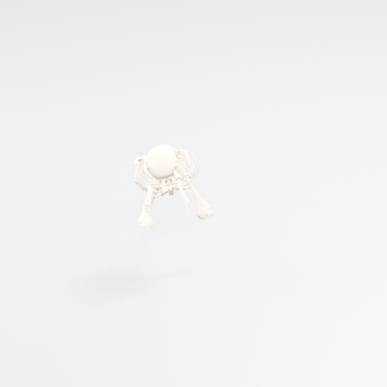
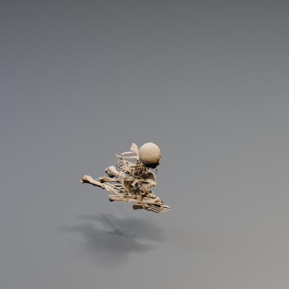
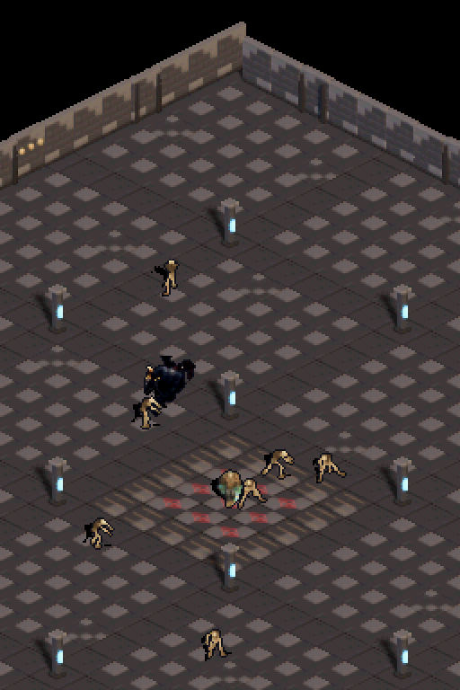

# Colapso coreografiado del esqueleto

## Resultado

La primera versión usaba cuerpos rígidos libres; las colisiones entre piezas que nacían solapadas las disparaban en direcciones distintas. La reemplacé por una animación coreografiada: cada uno de los 18 segmentos de malla sigue una trayectoria acotada hasta una posición elegida en el montón. Hay una pequeña caída y giro durante el recorrido, y el fotograma final queda fijo.

Ya no depende de gravedad ni de colisiones en tiempo de ejecución o en Blender. Esa decisión sacrifica física libre a cambio de controlar la silueta final y evitar que el cráneo, las costillas y las extremidades salgan volando. El render directo del FBX deja revisar el resultado antes del pixelador.

## Comprobación 3D

El FBX se reimportó en Blender y sus acciones por pieza se renderizaron a 640×640. El baker e30 también completó el spritesheet de ocho direcciones por ocho fotogramas y sus sombras.

## Pipeline

- `tools/create_skeleton_death_fbx.py` genera el FBX desde `assets/characters/skeleton/skeleton.fbx`.
- `tools/render_skeleton_death_3d_preview.py` importa ese FBX, prepara cámara e iluminación y renderiza los 37 fotogramas a 640×640 antes del baker de sprites.
- `assets/skeleton-death-3d-preview.blend` contiene la escena de Blender, con la animación en la línea de tiempo para poder verla y recorrerla en 3D.

## Evidencia

## Alcance

El colapso ya está conectado a la muerte del esqueleto por lanza ósea: las ocho orientaciones recorren ocho poses y la última queda como montón persistente. Los cadáveres dejan de moverse y de atraer el autoapuntado. La reanimación de la pila queda fuera de este cambio.

## Verificación en juego

- `tools/convert_iso_to_c.py --preset e30` incorpora `skeleton_death_e30.png` como frames BGR555 de runtime.
- `tests/test_bone_lance_contract.py`: 4/4 PASS.
- `scripts/build-project.ps1`: BlocksDS PASS.
- `scenarios/bone_dismemberment_preview.json`: DeSmuME PASS (120 frames disparando, 3 capturas).

